# DeskMind — Product User Guide

> **Classify · Route · Resolve** — DeskMind is an AI-powered IT support desk that automatically classifies every ticket into the right domain, routes it to the right team, and suggests a resolution — using a 4-classifier ensemble, a knowledge graph of your infrastructure, and a local LLM (no cloud, no data leaving your network).

This guide walks through DeskMind from a user's point of view. It's organized by **the three roles** in the system, so jump to the section that matches how you use the product.

| Role | What you do | Jump to |
|------|-------------|---------|
| **Requester** | Submit IT tickets, answer follow-up questions, track status, ask the AI assistant | [§3 For Requesters](#3-for-requesters) |
| **Engineer** | Work your team's queue — pick up, resolve, escalate, or correct the AI | [§4 For Engineers](#4-for-engineers) |
| **Admin** | Manage users, explore the knowledge graph, and view system-wide analytics | [§5 For Admins](#5-for-admins) |

---

## 1. What is DeskMind?

When an IT issue is reported, DeskMind reads the description, figures out **which of 6 IT domains** it belongs to, **how confident** it is, and **which team** should handle it — in a few seconds, with no manual triage.

Every ticket flows through a five-stage pipeline:

1. **Prepare** — extract entities (servers, services, error codes) and assess description quality
2. **Retrieve** — find similar past tickets, matching error codes, and infrastructure context from the knowledge graph
3. **Classify** — four independent classifiers vote: **LLM (40%)**, **Centroid (30%)**, **KNN (15%)**, **Keyword (15%)**
4. **Aggregate** — combine the votes into a final category + confidence
5. **Decide** — route to the right team, or escalate to a human if confidence is low

The result: faster routing, fewer misrouted tickets, and a suggested fix grounded in what actually worked before.

---

## 2. Getting Started

### Logging in

Open DeskMind in your browser (e.g. `http://localhost:3000`) and sign in with your email and password.

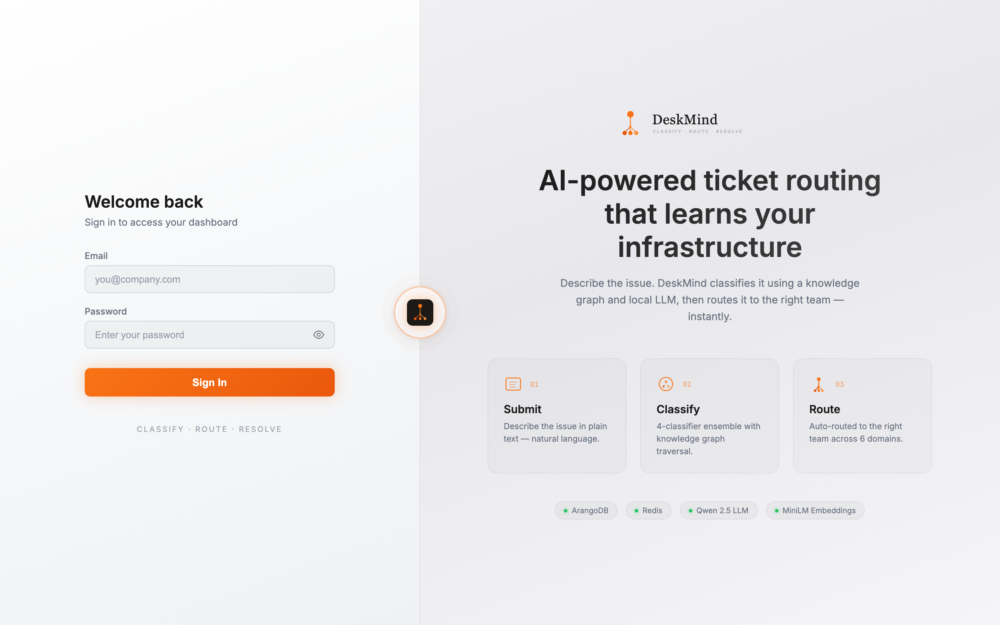

> **Demo instance:** sign in as the seeded administrator `arif.asadullah@schwettmann.in` (password as configured during setup — see the [Deployment Guide](deployment.md)). Admins create all other accounts from the **Users** screen (see [§5](#5-for-admins)).

### Finding your way around

After signing in you land on the **Domain Dashboard**. The top bar is your main navigation:

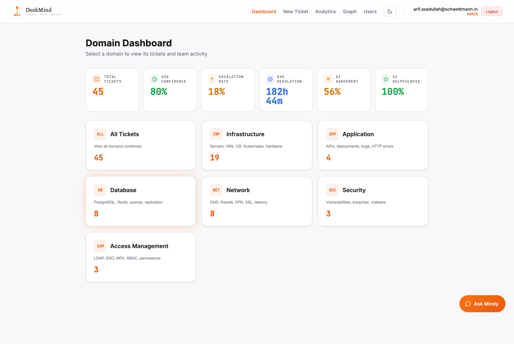

- **Dashboard** — tickets grouped by the 6 IT domains, with live counts
- **New Ticket** — open the ticket-submission form (any role)
- **Analytics** — charts and metrics (team-scoped for engineers, global for admins)
- **Graph** — the infrastructure knowledge graph *(admins only)*
- **Users** — account management *(admins only)*
- **Theme toggle** (sun/moon), your **email + role badge**, and **Logout** on the right
- **Ask Mindy** — the floating AI-assistant button (bottom-right)

The cards across the top show at-a-glance health: **Total Tickets, Avg Confidence, Escalation Rate, Avg Resolution time, AI Agreement,** and **AI Helpfulness**.

> **Degraded-mode banner:** if a component (the LLM, database, or cache) is unavailable, a banner appears showing the degradation level (1–4). DeskMind keeps working with fewer classifiers rather than going offline — it just routes more conservatively.

---

## 3. For Requesters

### Submitting a ticket

Click **New Ticket**, then describe the issue in plain language:

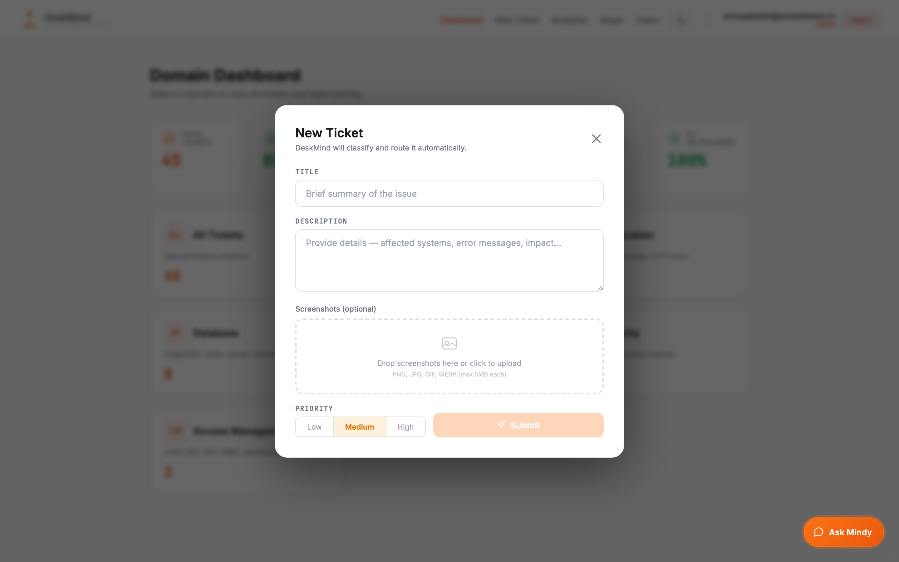

- **Title** — a short summary
- **Description** — the details: affected systems, error messages, impact
- **Priority** — `low`, `medium`, or `high`
- **Screenshots (optional)** — drag-and-drop an image (e.g. an error log or stack trace). DeskMind runs OCR to read the text and pull out servers, services, and error codes automatically.

Click **Submit** and DeskMind classifies and routes the ticket in a few seconds.

### Understanding the result

You'll see the assigned **category**, a **confidence** score, the **team** it was routed to, and the AI's reasoning. Confidence drives what happens next:

| Confidence | What happens |
|------------|--------------|
| **≥ 70%** | **Routed** automatically to the right team |
| **50–69%** | **Escalated** for a human to confirm |
| **< 70% + low quality** | DeskMind asks you for **more details** (enrichment) |

### Answering follow-up questions (enrichment)

If your description is too vague to classify confidently, DeskMind asks a few targeted questions instead of guessing. Click the suggested chips or type your own answer, then **Submit & Re-classify**:

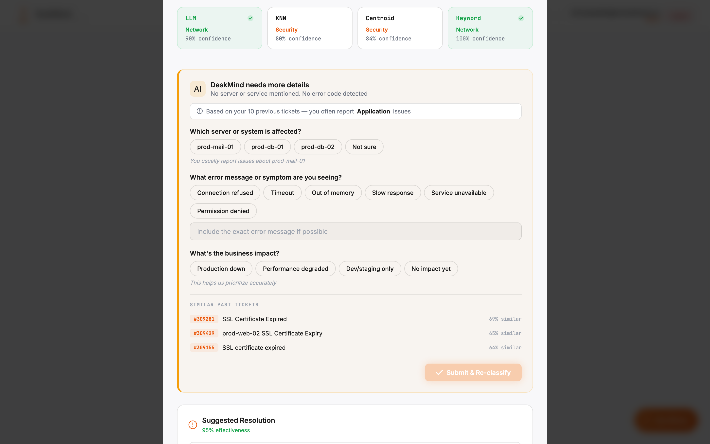

It even personalizes the questions based on your past tickets and shows similar issues it found. Once you answer, the ticket is re-classified with the new detail — usually jumping straight to a confident route.

### Tracking your ticket

Open any ticket from the dashboard to see its current **status**, the full **audit timeline** (every action, by the AI or a person), and — once an engineer resolves it — the resolution steps. Status badges tell you where it stands: **Routed → In Progress → Resolved** (or **Escalated** / **Pending Human** if it needs review).

### Asking Mindy (the AI assistant)

Click **Ask Mindy** (bottom-right) any time to ask about tickets, teams, or IT issues in plain English — e.g. *"status of ticket #206129"* or *"which team handles database?"*. Mindy is **grounded**: it answers from real database facts, not invented data.

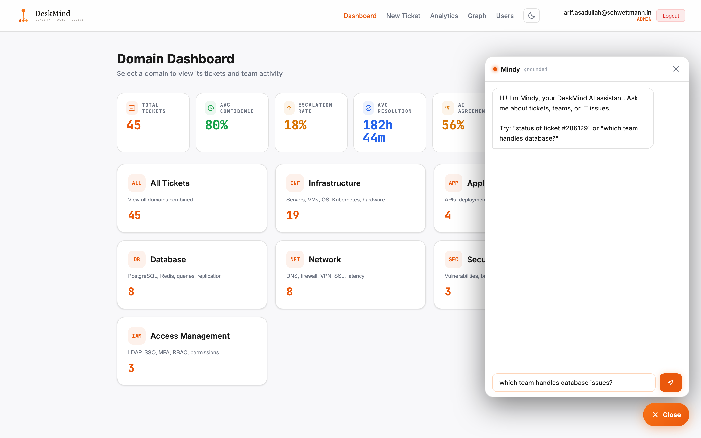

---

## 4. For Engineers

Engineers see and work the tickets routed to **their team**.

### Your queue

The dashboard lists your team's tickets. Filter by **status** or **priority**, **search** by keyword or ticket ID, and switch between **card** and **list** views:

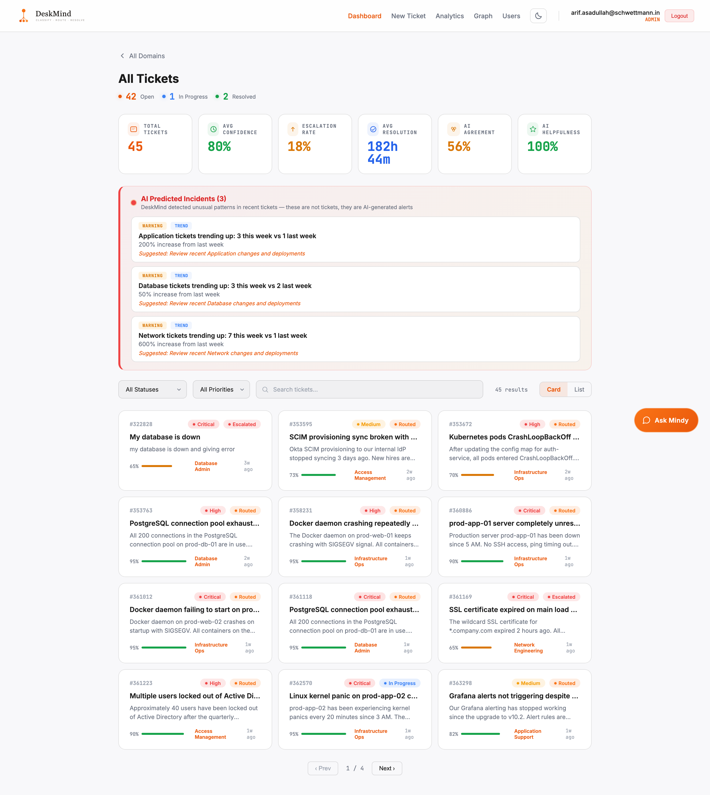

### Reading a ticket

Open a ticket to see the full AI analysis:

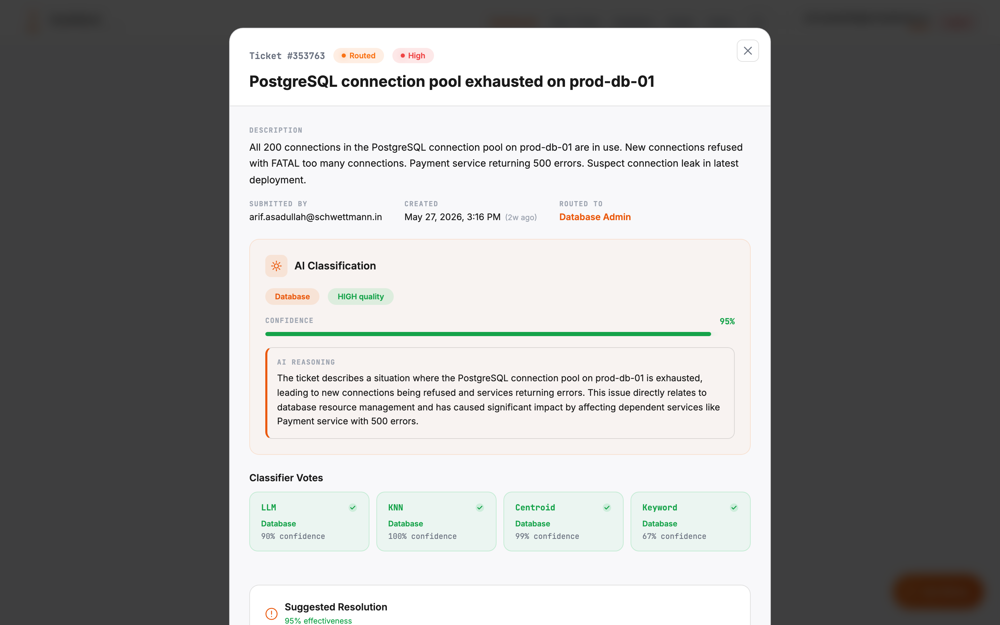

- **AI Classification** — the category, a **quality** badge (HIGH/MEDIUM/LOW), the **confidence** bar, and the AI's **reasoning**
- **Classifier Votes** — how each of the four classifiers voted, with a check on the ones that agree with the final decision. This is the transparency layer: you can see *why* a category won (and when one classifier dissents — e.g. Keyword voting "Application" while the ensemble holds "Security").

Scroll down for the **Suggested Resolution** (with an effectiveness score), a **Recommended Runbook**, any **Automation Suggestion** for recurring issues, and the **Recommended Expert**:

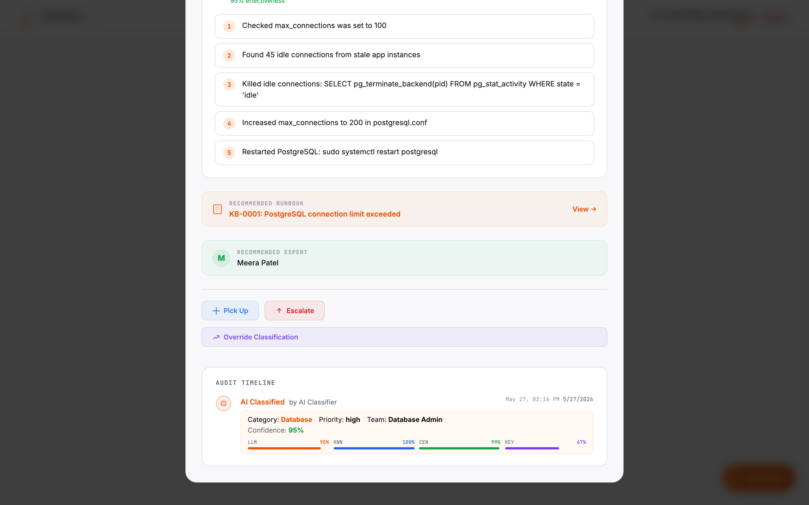

> **Relevant runbooks only:** DeskMind shows a runbook **only when it genuinely matches** the ticket. If no runbook is a real fit, none is shown — a wrong runbook is worse than none. For example, this brute-force **Security** ticket correctly shows **no** runbook rather than an unrelated one:
>
> 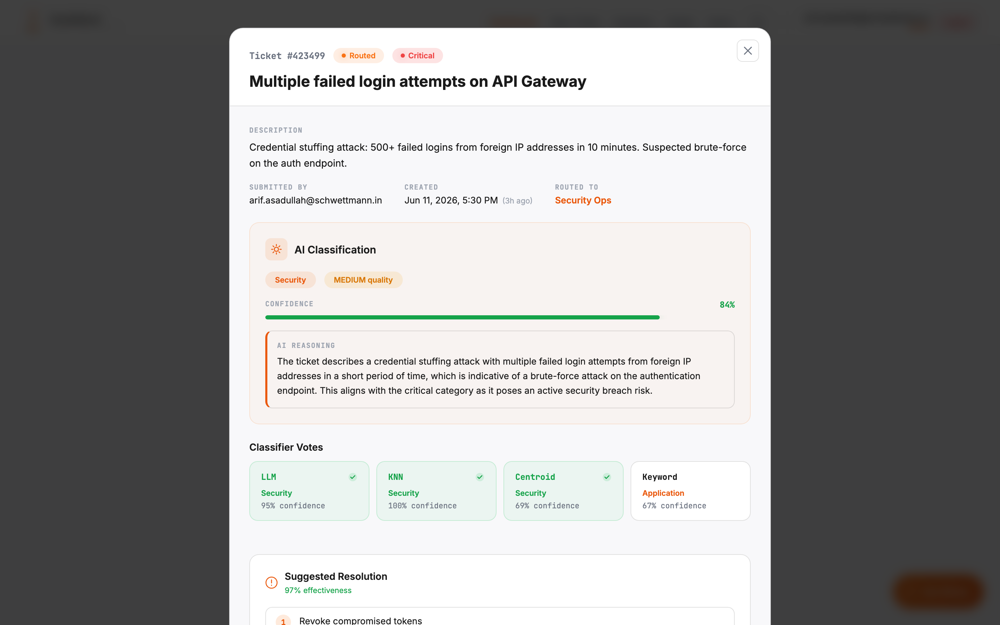

### Picking up and resolving

For a routed ticket, click **Pick Up** (status → *In Progress*), then **Resolve** when done. The resolve form **pre-fills the AI's suggested steps** so you can confirm or edit them, record the runbook used, and rate whether the AI suggestion helped:

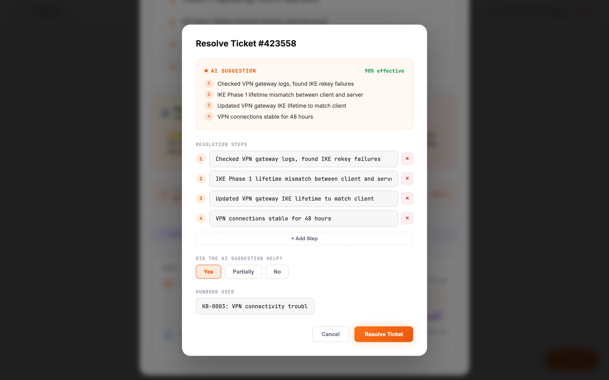

You can also **Escalate** a ticket at any point if it needs a higher tier or another team.

### Correcting the AI (override)

If the AI got the category wrong, click **Override Classification**. You'll see the AI's predictions and per-classifier votes for context, then choose the correct **category** and **priority** and give a **reason**. The override is recorded in the audit trail — and feeds DeskMind's self-learning so it improves over time:

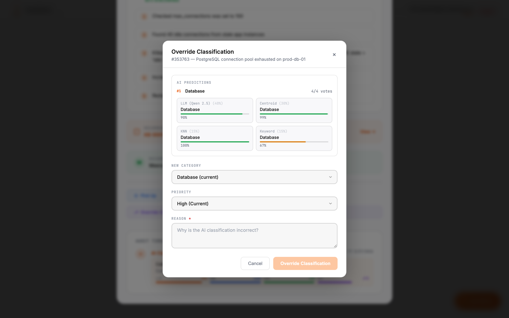

### Giving feedback

After a ticket is resolved, rate the AI's suggestion **👍 Helpful / 👎 Not Helpful**. This feedback loop is how DeskMind's accuracy keeps improving.

---

## 5. For Admins

Admins have full visibility across all teams and domains, plus three admin-only areas.

### Managing users

The **Users** screen lets you create accounts, assign each user a **role** (admin / engineer / requester) and a **team**, and activate/deactivate accounts:

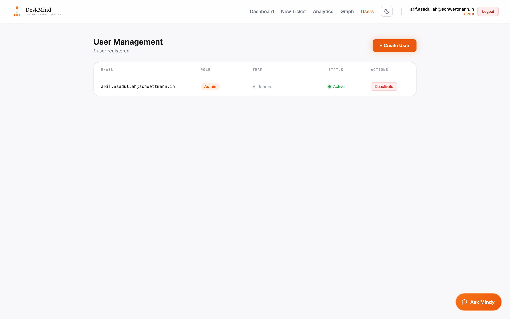

> Engineers are scoped to exactly one team and only see that team's tickets. Admins bypass team scoping and see everything.

### Exploring the knowledge graph

The **Graph** screen visualizes the infrastructure DeskMind reasons over — teams, engineers, servers, services, tickets, and error codes, and the relationships between them. Filter by node type or domain, and click a node to inspect its connections:

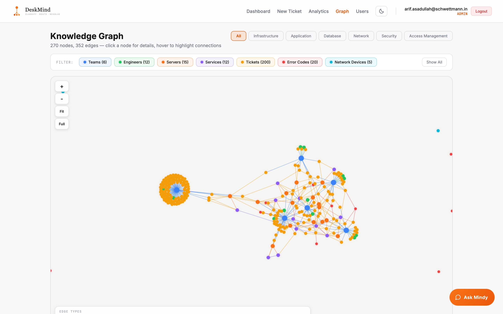

### Viewing analytics

The **Analytics** screen shows system-wide trends — tickets by category, status, and priority; confidence distribution; classifier agreement; resolution times; and AI-helpfulness:

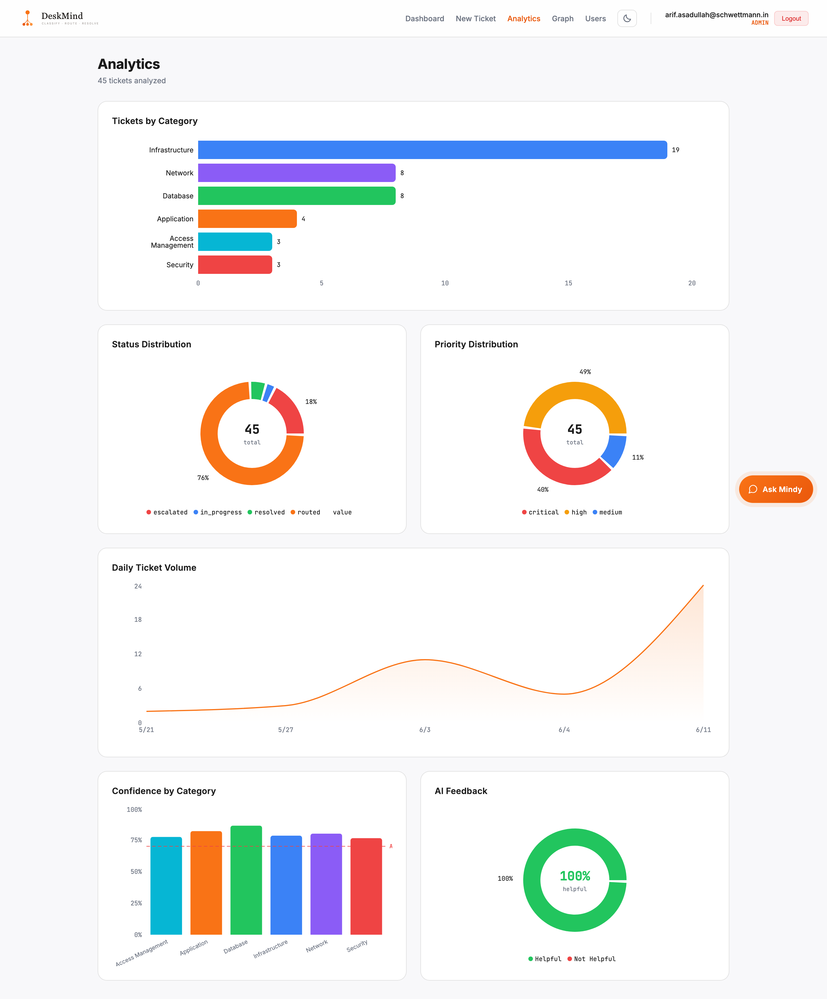

Admins also have access to the **SLA-breach report** to spot tickets at risk of missing their service-level target.

---

## 6. Reference

### The 6 domains and their teams

| Domain | Routes to | Typical issues |
|--------|-----------|----------------|
| **Infrastructure** | Infrastructure Ops | Servers, VMs, OS, Kubernetes, hardware |
| **Application** | Application Support | APIs, deployments, bugs, HTTP errors |
| **Database** | Database Admin | PostgreSQL, Redis, queries, replication |
| **Network** | Network Engineering | DNS, firewall, VPN, SSL, latency |
| **Security** | Security Ops | Vulnerabilities, breaches, malware, brute-force |
| **Access Management** | Access Management | LDAP, SSO, MFA, RBAC, permissions |

### Ticket statuses

| Status | Meaning |
|--------|---------|
| **Routed** | Auto-assigned to a team, awaiting pick-up |
| **In Progress** | An engineer has picked it up |
| **Escalated** | Flagged for human review (medium confidence) |
| **Pending Human** | Queued for an analyst (low confidence / degraded mode) |
| **Resolved** | Fixed; resolution steps recorded |

### Confidence & routing

| Confidence | Outcome |
|------------|---------|
| ≥ 0.70 | Routed automatically |
| 0.50 – 0.69 | Escalated for confirmation |
| < 0.50 (degraded) | Pending human review |

### Priority & SLA targets

| Priority | SLA to resolve |
|----------|----------------|
| Critical | 2 hours |
| High | 4 hours |
| Medium | 8 hours |
| Low | 24 hours |

### Roles & permissions

| Capability | Requester | Engineer | Admin |
|------------|:---------:|:--------:|:-----:|
| Submit tickets | ✅ | ✅ | ✅ |
| Track own tickets | ✅ | ✅ | ✅ |
| Ask Mindy | ✅ | ✅ | ✅ |
| Work / resolve tickets | — | ✅ (own team) | ✅ (all) |
| Override classification | — | ✅ (own team) | ✅ (all) |
| Give AI feedback | ✅ | ✅ | ✅ |
| Analytics | own | team | global |
| Knowledge graph | — | — | ✅ |
| Manage users | — | — | ✅ |

---

*DeskMind — Classify · Route · Resolve. For setup and deployment, see the [Deployment Guide](deployment.md). For architecture and design, see [docs/nasscom-r2/](nasscom-r2/).*
