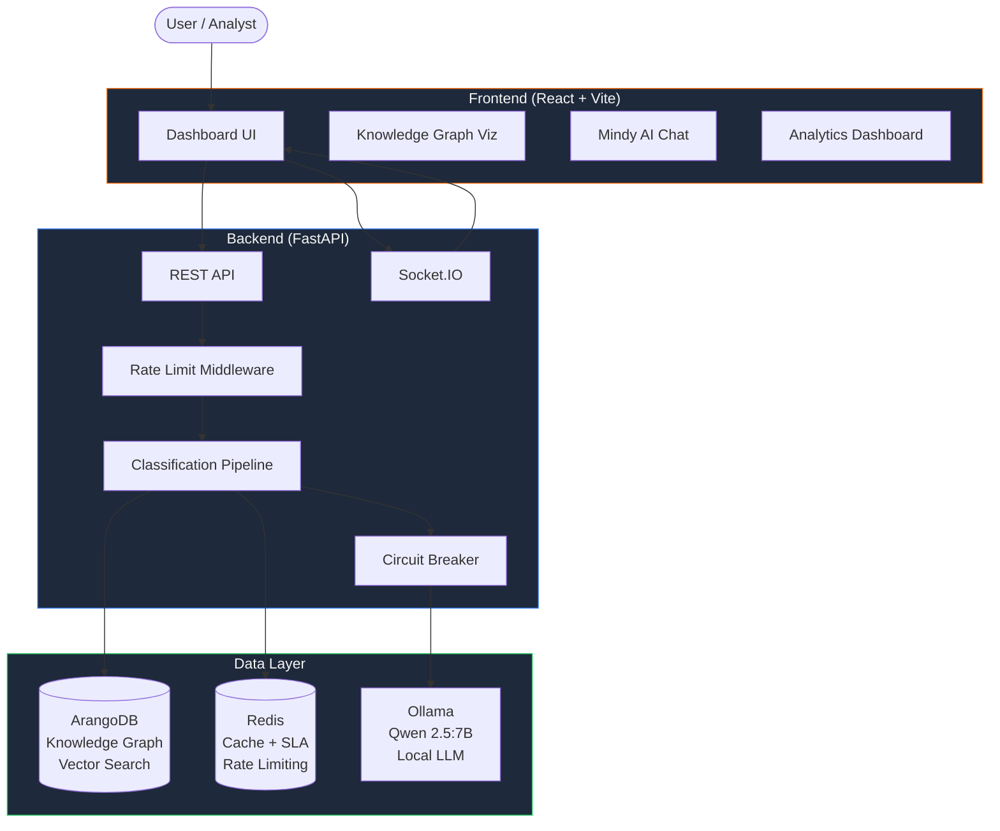
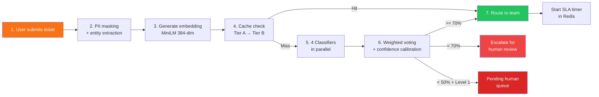
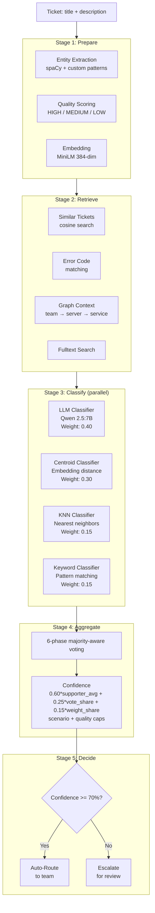
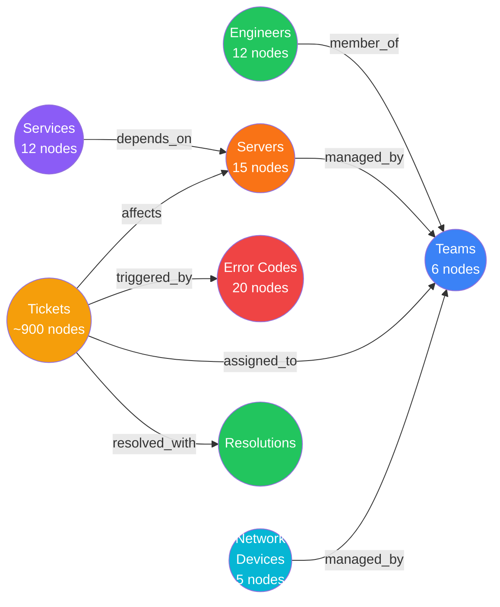
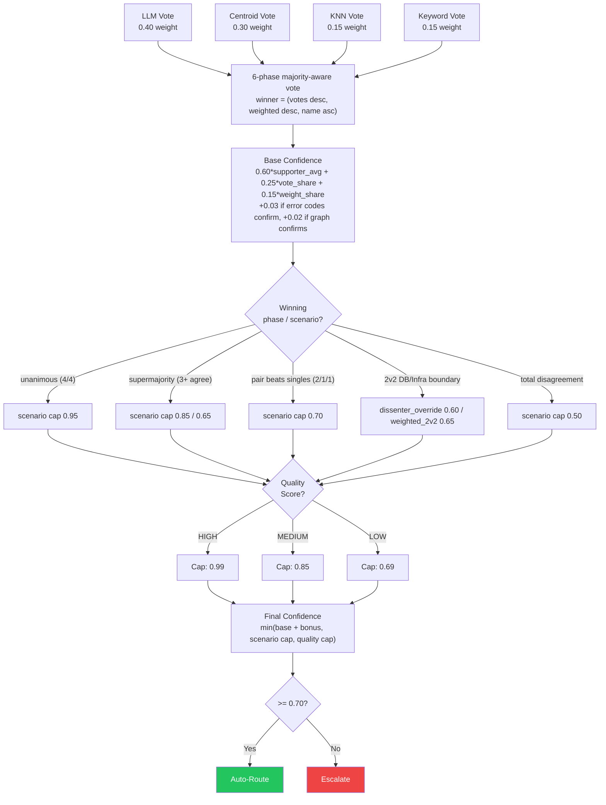
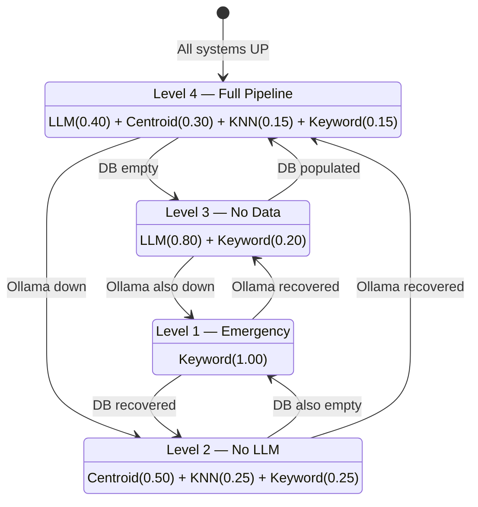

# Architecture Diagrams

All diagrams use [Mermaid](https://mermaid.js.org/) syntax and render natively on GitHub.

---

## 1. System Container Diagram

---

## 2. Data Flow Diagram (7 Steps)

---

## 3. AI Classification Pipeline

---

## 4. Knowledge Graph Schema

**Node types:** 7 | **Edge types:** 8 | **Total nodes:** ~975 (live DB, 2026-06-11; illustrative)

---

## 5. Multi-Signal Confidence Flow

---

## 6. Graceful Degradation Levels

