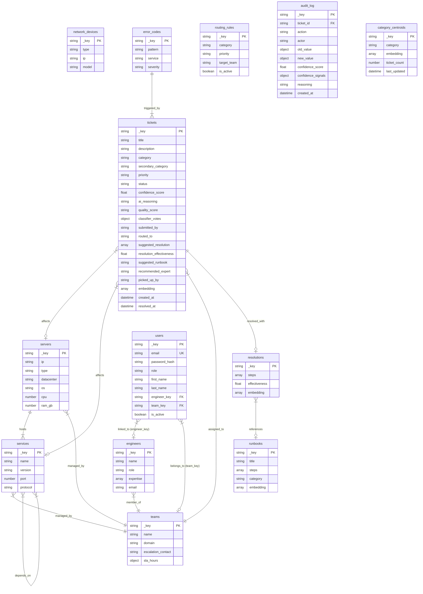

# DeskMind — Entity-Relationship Diagram

> **Nasscom AI-Code-Sarathi Excel Hackathon — Final Round (Jury)**
> **Team**: Arif Asadullah, Aakarsh, Mohit Tomar
> **Date**: June 2026

---

## 1. Entity-Relationship Diagram

The following Mermaid diagram models the **13 graph-participating document collections** as entities and all **9 edge collections** as relationships within DeskMind's ArangoDB knowledge graph. (The schema defines **15 document collections** in total; the auxiliary `corrections` and `repeated_issues` collections are not part of the graph and are omitted from this diagram.)



---

## 2. Entity Descriptions

Every document collection in the `deskmind_graph`, its purpose, key fields, and current record count.

| # | Collection | Purpose | Key Fields | Records |
|---|-----------|---------|------------|---------|
| 1 | `tickets` | Every support ticket submitted to or ingested by DeskMind. This is the central collection -- all other entities exist to help classify, route, and resolve these tickets. AI enrichment fields (`suggested_resolution`, `resolution_effectiveness`, `suggested_runbook`, `recommended_expert`) are stored directly in the document. The `picked_up_by` field tracks which engineer has claimed ownership of the ticket. | `title`, `description`, `category`, `priority`, `status`, `confidence_score`, `embedding` (384-dim), `classifier_votes`, `routed_to`, `suggested_resolution`, `resolution_effectiveness`, `suggested_runbook`, `recommended_expert`, `picked_up_by` | **855** training set (55 seed + 800 synthetic: 355 GPT-4o + 164 Claude + 13 Phi-4 + 174 template noise + 94 untagged); live DB ~900 (2026-06-11) |
| 2 | `teams` | The 6 IT specialist teams that own ticket resolution. Each team maps to one of the 6 classification categories and defines SLA targets per priority level. | `name`, `domain`, `escalation_contact`, `sla_hours` | **6** |
| 3 | `engineers` | Individual team members with named expertise. Used by the graph traversal to recommend a specific expert for each ticket based on matching skills. | `name`, `role`, `expertise` (array), `email` | **12** (2 per team) |
| 4 | `servers` | Physical or virtual machines in the managed infrastructure. Entity extraction recognizes server hostnames in ticket text and uses them to enter the knowledge graph. | `ip`, `type`, `datacenter`, `os`, `cpu`, `ram_gb` | **15** |
| 5 | `services` | Software services running on servers -- databases, web servers, APIs, monitoring tools. Linked to servers via `hosts` and to each other via `depends_on` for dependency analysis. | `name`, `version`, `port`, `protocol` | **12** |
| 6 | `network_devices` | Network infrastructure -- firewalls, switches, routers, load balancers. Enables investigation of network-layer causes when a server is unreachable. | `type`, `ip`, `model` | **5** |
| 7 | `error_codes` | A catalog of 20 known error patterns that the error scanner matches against ticket text. Each pattern maps to a service and a pre-defined severity, giving a confidence bonus when matched. | `pattern`, `service`, `severity` | **20** |
| 8 | `runbooks` | Pre-written step-by-step guides for common IT issues. Attached to routing decisions so engineers get documented procedures alongside the ticket. | `title`, `steps` (array), `category`, `embedding` (384-dim) | **10** |
| 9 | `resolutions` | Actual fixes applied to specific past tickets. Different from runbooks: resolutions are concrete actions taken on a real incident. The primary suggestion path is similarity-gated: a past resolution is surfaced only if it shares the same category AND its similarity to the new ticket is >= 0.55 (`RES_SIM_THRESHOLD`), taking the first relevance-reranked match (score = 0.60·similarity + 0.20·recency + 0.20·effectiveness) -- not simply the highest-effectiveness one. | `steps` (array), `effectiveness` (0.0--1.0), `embedding` (384-dim) | **30** (seed; grows as tickets are resolved) |
| 10 | `routing_rules` | A configurable lookup table mapping `{category, priority}` pairs to target teams. 4 rules per category (one per priority level). Updateable without code changes. | `category`, `priority`, `target_team`, `is_active` | **24** |
| 11 | `audit_log` | Immutable log of every action taken on every ticket -- classification, routing, escalation, human overrides, resolution. Provides full decision traceability for compliance and debugging. | `ticket_id`, `action`, `actor`, `old_value`, `new_value`, `confidence_score`, `confidence_signals`, `reasoning`, `created_at` | **Growing** (1 per classification + 1 per status change) |
| 12 | `category_centroids` | The average embedding (centroid) for each of the 6 ticket categories. Used by the centroid classifier to determine which category center a new ticket is closest to. Recomputed periodically. | `category`, `embedding` (384-dim), `ticket_count`, `last_updated` | **6** |
| 13 | `users` | Authentication accounts for RBAC. Each user has an email, bcrypt-hashed password, role (admin/engineer/user), and optional links to an engineer and team. Engineers are team-scoped — they can only see tickets routed to their team. | `email` (unique), `password_hash`, `role`, `first_name`, `last_name`, `engineer_key`, `team_key`, `is_active` | **Growing** (1 admin seeded, rest created via UI) |
| 14 | `corrections` | *Auxiliary (not in the graph).* Records human overrides of AI classifications -- the original predicted category, the corrected category, and who made the change. Feeds the learning loop and the repeated-issue detector. | `ticket_id`, `predicted_category`, `corrected_category`, `actor`, `created_at` | **Growing** (1 per human correction) |
| 15 | `repeated_issues` | *Auxiliary (not in the graph).* Clusters of tickets identified as recurring problems, used to surface systemic issues to operators. | `signature`, `ticket_ids`, `count`, `last_seen` | **Growing** (computed from ticket history) |

**Totals**: **15 document collections** (13 graph-participating + the auxiliary `corrections` and `repeated_issues`); **9 edge collections** holding ~3,500 edges generated at seed time. Document and edge totals are runtime figures and are reported here as approximate seed-time values.

---

## 3. Relationship Descriptions

Every edge collection in the `deskmind_graph`, its directionality, cardinality, and semantic meaning.

| # | Edge Collection | From | To | Cardinality | Meaning |
|---|----------------|------|-----|-------------|---------|
| 1 | `hosts` | `servers` | `services` | **1 : N** -- One server hosts many services; a service may run on multiple servers | Server _runs_ a software service. Answers: "What services are on prod-db-01?" and "Which servers run PostgreSQL?" |
| 2 | `managed_by` | `servers`, `services` | `teams` | **N : 1** -- Many servers/services are managed by one team | Server or service is _owned by_ a team. Even before AI classification, a mentioned server name can immediately identify the responsible team. |
| 3 | `depends_on` | `services` | `services` | **M : N** -- Services can depend on many services and be depended upon by many | Service A _requires_ Service B to function. Enables root-cause analysis: when OrderService is slow, traverse `depends_on` to discover the real culprit may be PostgreSQL or Redis. |
| 4 | `member_of` | `engineers` | `teams` | **N : 1** -- Many engineers belong to one team | Engineer _belongs to_ a team. After identifying the target team, the system traverses this edge to find an expert with matching skills. |
| 5 | `affects` | `tickets` | `servers`, `services` | **M : N** -- A ticket can affect multiple servers/services; a server/service can be affected by many tickets | Ticket _is about_ a specific server or service. Enables historical pattern analysis: "Is prod-db-01 having recurring issues?" |
| 6 | `assigned_to` | `tickets` | `teams` | **N : 1** -- Many tickets are assigned to one team; each ticket has one current assignment | Ticket was _routed to_ a team for handling. Updated when tickets are reassigned. Drives team workload dashboards. |
| 7 | `resolved_with` | `tickets` | `resolutions` | **1 : 1** -- Each resolved ticket has exactly one resolution record | Ticket was _fixed by_ a specific set of steps. The core of the learning loop: new ticket -> find similar past ticket -> follow `resolved_with` -> suggest that resolution. |
| 8 | `references` | `resolutions` | `runbooks` | **N : 1** -- Many resolutions can reference the same runbook | Resolution _was based on_ a documented runbook. Validates which runbooks are effective in practice and links specific fixes back to standardized procedures. |
| 9 | `triggered_by` | `error_codes` | `tickets` | **1 : N** -- One error code appears in many tickets | Known error pattern _appeared in_ a ticket. Enables fast pattern matching: find all past tickets with the same error code and surface their resolutions, bypassing slower embedding search. |

---

## 4. Index Reference

All indexes defined in `backend/services/schema.py` for query optimization.

### 4.1 Persistent Indexes

| Collection | Index Name | Fields | Purpose |
|-----------|-----------|--------|---------|
| `tickets` | `idx_tickets_category` | `category` | Fast filtering by classification category |
| `tickets` | `idx_tickets_priority` | `priority` | Fast filtering by priority level |
| `tickets` | `idx_tickets_status` | `status` | Fast filtering by lifecycle status |
| `tickets` | `idx_tickets_created_at` | `created_at` | Time-ordered queries and SLA tracking |
| `routing_rules` | `idx_rules_category_priority` | `category`, `priority` | Compound lookup: given a category+priority pair, find the target team |
| `audit_log` | `idx_audit_ticket_id` | `ticket_id` | Fast retrieval of all audit entries for a specific ticket |
| `audit_log` | `idx_audit_created_at` | `created_at` | Time-ordered audit trail queries |
| `users` | `idx_users_email` | `email` (unique) | Fast login lookup, prevent duplicate accounts |

### 4.2 Full-Text Indexes

| Collection | Index Name | Field | Purpose |
|-----------|-----------|-------|---------|
| `tickets` | `idx_tickets_title_ft` | `title` | Keyword search on ticket titles (Stage 2 full-text retrieval) |
| `tickets` | `idx_tickets_description_ft` | `description` | Keyword search on ticket descriptions (Stage 2 full-text retrieval) |

### 4.3 Vector Indexes (384-dimensional, Cosine Similarity)

| Collection | Index Name | Field | Parameters | Purpose |
|-----------|-----------|-------|-----------|---------|
| `tickets` | `idx_tickets_embedding` | `embedding` | dim=384, metric=cosine, nLists=10 | Semantic similarity search for KNN classifier (Stage 2 vector retrieval) |
| `runbooks` | `idx_runbooks_embedding` | `embedding` | dim=384, metric=cosine, nLists=10 | Find the most relevant runbook for a given ticket |
| `resolutions` | `idx_resolutions_embedding` | `embedding` | dim=384, metric=cosine, nLists=10 | Find the most relevant past resolution for a given ticket |

---

## 5. Knowledge Graph Narrative

### 5.1 How the Graph Connects Everything

DeskMind's knowledge graph is not a flat database of isolated records. It is a living network where **every entity is connected to related entities through typed, directional edges**. This structure is what makes GraphRAG possible -- the AI does not just look at one ticket in isolation; it traverses the graph to build context that a standalone LLM cannot access.

The graph has four conceptual layers:

**Infrastructure Layer** -- Servers host services, and services depend on other services. This models the physical and logical topology of the IT environment. When a ticket mentions a server name, the system can immediately discover which services run on it, which other services depend on those services, and who manages all of them.

**Organizational Layer** -- Teams manage servers and services. Engineers are members of teams. Routing rules map categories and priorities to teams. This layer bridges the gap between "what is broken" (infrastructure) and "who can fix it" (people).

**Incident Layer** -- Tickets affect servers and services. Tickets are assigned to teams. Tickets are resolved with specific resolution steps. Resolutions reference runbooks. Error codes trigger tickets. This layer captures the history of incidents and their fixes, enabling the system to learn from past experience.

**Authentication Layer** -- Users are authentication accounts linked to engineers via `engineer_key` and to teams via `team_key`. This layer controls access: admins see all tickets, engineers only see their team's tickets, users have read-only access. The `users` collection is deliberately separate from `engineers` — auth accounts and knowledge graph entities have different lifecycles.

The magic happens when the AI traverses **across** these layers in a single query. A new ticket mentioning "prod-db-01" does not just find the server -- it follows edges to discover the services, the team, the experts, past incidents, their resolutions, and the matching runbooks. All of this context is injected into the classification pipeline.

### 5.2 Traversal Walkthrough Example

A user submits the following ticket:

> **Title**: "PostgreSQL not accepting connections on prod-db-01"
> **Description**: "prod-db-01 refusing connections since 10am. max_connections reached at 100. App team reporting 502 errors on the checkout page."

Here is exactly how DeskMind traverses the knowledge graph to classify, route, and enrich this ticket:

---

**Step 1 -- Entity Extraction (Stage 1: Prepare)**

The entity extractor scans the ticket text against cached lists of known entities:
- Server matched: `prod-db-01` (from `servers` collection)
- Service matched: `postgresql` (from `services` collection)
- Error matched: `ERR-PG-001` with pattern "FATAL: too many connections" (from `error_codes` collection)

These extracted entities become the **entry points** into the graph.

**Step 2 -- Server Lookup and Infrastructure Context (Stage 2: Graph Retrieval)**

Starting from `servers/prod-db-01`:

```
servers/prod-db-01
  |
  |-- hosts --> services/postgresql (PostgreSQL 15.4, port 5432)
  |-- hosts --> services/redis (Redis 7.2, port 6379)
  |-- managed_by --> teams/db-admin (Database Admin team)
```

The system now knows: prod-db-01 is a database server in ap-south-1, running PostgreSQL and Redis, managed by the Database Admin team. This alone strongly suggests a "Database" category classification.

**Step 3 -- Service Dependency Chain**

Starting from `services/postgresql`:

```
services/postgresql
  |
  |-- managed_by --> teams/db-admin
  |
  <-- depends_on -- services/order-service (OrderService depends on PostgreSQL)
  <-- depends_on -- services/api-gateway (indirectly, via order-service)
```

This reveals the blast radius: if PostgreSQL is down, OrderService and everything upstream of it (APIGateway, NGINX, end users) will be affected. The "502 errors on the checkout page" mentioned in the ticket confirms this dependency chain.

**Step 4 -- Historical Tickets on This Server**

Reverse traversal on the `affects` edge from `servers/prod-db-01`:

```
servers/prod-db-01
  |
  <-- affects -- tickets/TKT-042 ("PostgreSQL max_connections exceeded", resolved, Database)
  <-- affects -- tickets/TKT-089 ("Database replication lag on prod-db-01", resolved, Database)
```

Two past tickets on the same server. Both were classified as "Database". This provides historical confirmation for the category.

**Step 5 -- Past Resolutions**

Follow the `resolved_with` edge from the most relevant past ticket:

```
tickets/TKT-042
  |
  |-- resolved_with --> resolutions/RES-015
      Steps: ["Increased max_connections from 100 to 200",
              "Restarted PostgreSQL",
              "Verified with pg_isready"]
      Effectiveness: 0.95
      |
      |-- references --> runbooks/KB-0001
          Title: "PostgreSQL connection limit exceeded"
          Steps: [5-step procedure for handling max_connections]
```

The system now has a concrete, proven resolution from a nearly identical past incident, plus the formal runbook.

**Step 6 -- Error Code Matching**

The error pattern "FATAL: too many connections" was matched to `error_codes/ERR-PG-001`. Follow the `triggered_by` edge:

```
error_codes/ERR-PG-001
  |
  |-- triggered_by --> tickets/TKT-042 (same ticket from Step 4)
  |-- triggered_by --> tickets/TKT-150 (another PostgreSQL connection issue)
```

This confirms the error is a known, cataloged pattern with historical precedent. The error scanner gives a +0.03 confidence bonus because the error code maps to the "Database" category, matching the classifier output.

**Step 7 -- Expert Recommendation**

From the target team, traverse `member_of` to find engineers:

```
teams/db-admin
  |
  <-- member_of -- engineers/eng-001 (Arjun Nair, Senior DBA, expertise: [PostgreSQL, Redis, backup-recovery])
  <-- member_of -- engineers/eng-002 (Meera Patel, DBA, expertise: [PostgreSQL, replication, performance-tuning])
```

Arjun Nair is recommended: he is a Senior DBA with PostgreSQL expertise and is the first result from the team.

**Step 8 -- Final Decision (Stage 5: Decide)**

All signals converge:

| Signal Source | Category | Confidence |
|--------------|----------|------------|
| LLM Classifier (Qwen 2.5:7B) | Database | 0.94 |
| KNN Classifier (5 neighbors) | Database | 0.88 |
| Centroid Classifier | Database | 0.84 |
| Keyword Classifier | Database | 0.75 |
| Graph: managed_by domain | Database | confirms |
| Error code: ERR-PG-001 | Database | confirms |
| Historical tickets on server | Database | confirms |

The aggregator (`aggregator.py`) is a 6-phase majority-aware voting scheme, not a weighted sum with agreement bonuses. The six phases are: **Phase 0** single classifier; **Phase 1** unanimous; **Phase 2** supermajority (3+ agree, gated by vote strength); **Phase 3** pair-beats-singles (2/1/1); **Phase 4** 2v2 split (known boundary override, else weighted / avg-confidence / centroid tiebreak); **Phase 5** total disagreement (weighted fallback). The winning scenario sets a SCENARIO_CAP, and the result is also capped by the QUALITY_CAP.

Here all 4 classifiers agree on Database, so this resolves in **Phase 1 (unanimous_4)**, which sets a scenario cap of **0.95**. Confidence is then computed as:

```
base = 0.60·supporter_avg_conf + 0.25·vote_share + 0.15·weight_share
     = 0.60·((0.94+0.88+0.84+0.75)/4) + 0.25·(4/4) + 0.15·(1.0/1.0)
     = 0.60·0.8525 + 0.25 + 0.15
     = 0.5115 + 0.25 + 0.15 = 0.9115
bonus = +0.03 (error code ERR-PG-001 confirms Database) + 0.02 (graph confirms) = +0.05
final = round(min(0.9115 + 0.05, scenario_cap 0.95, quality_cap 0.99), 3)
      = round(min(0.9615, 0.95, 0.99), 3) = 0.95
```

Aggregated confidence: **0.95** (clamped by the unanimous_4 scenario cap; quality = HIGH, cap 0.99 not binding).

Since 0.95 >= 0.70 threshold, the ticket is **auto-routed** (not escalated).

**Final output:**

| Field | Value |
|-------|-------|
| Category | Database |
| Priority | High |
| Status | Routed |
| Confidence | 0.95 |
| Team | Database Admin |
| Expert | Arjun Nair (Senior DBA) |
| Suggested Resolution | "Increased max_connections from 100 to 200; Restarted PostgreSQL; Verified with pg_isready" (effectiveness: 0.95) |
| Runbook | KB-0001: PostgreSQL connection limit exceeded |
| Reasoning | "PostgreSQL connection limit issue on production database server. Mentions max_connections limit and prod-db-01. Confirmed by graph context and error code ERR-PG-001." |

This entire traversal -- across 3 graph layers, 7 edge types, and over a dozen documents -- happens within a single classification call and completes in under 5 seconds.
