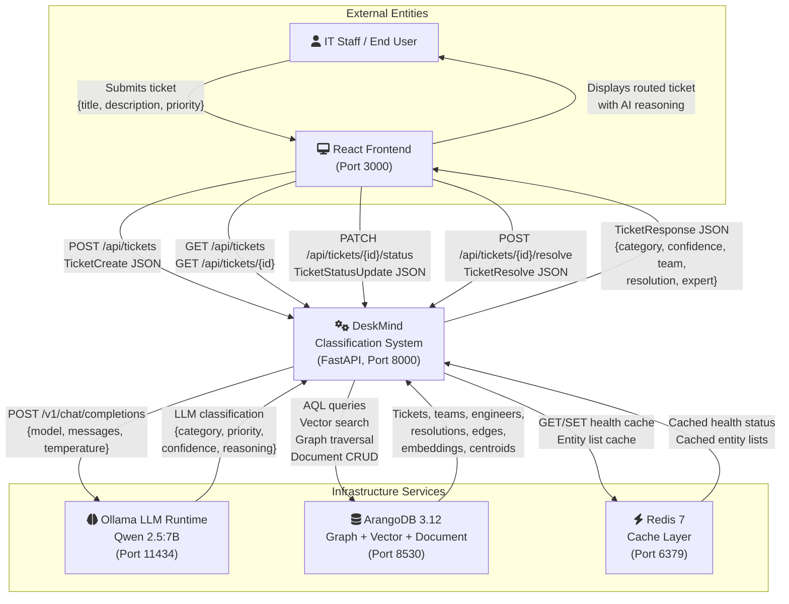
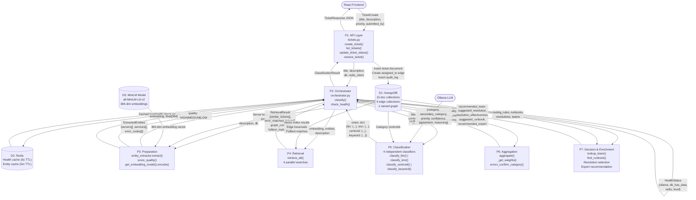
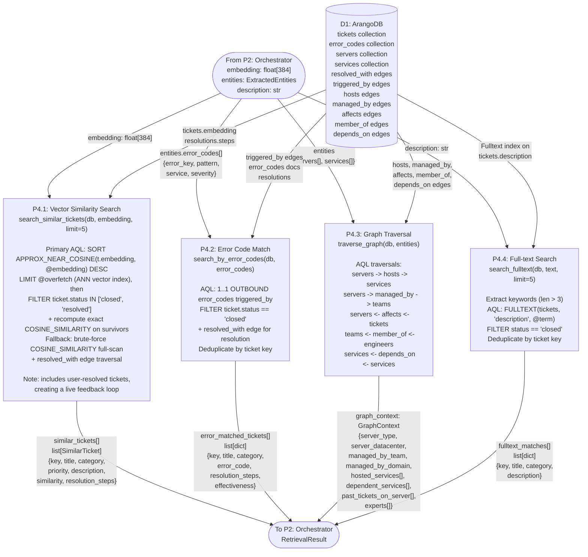
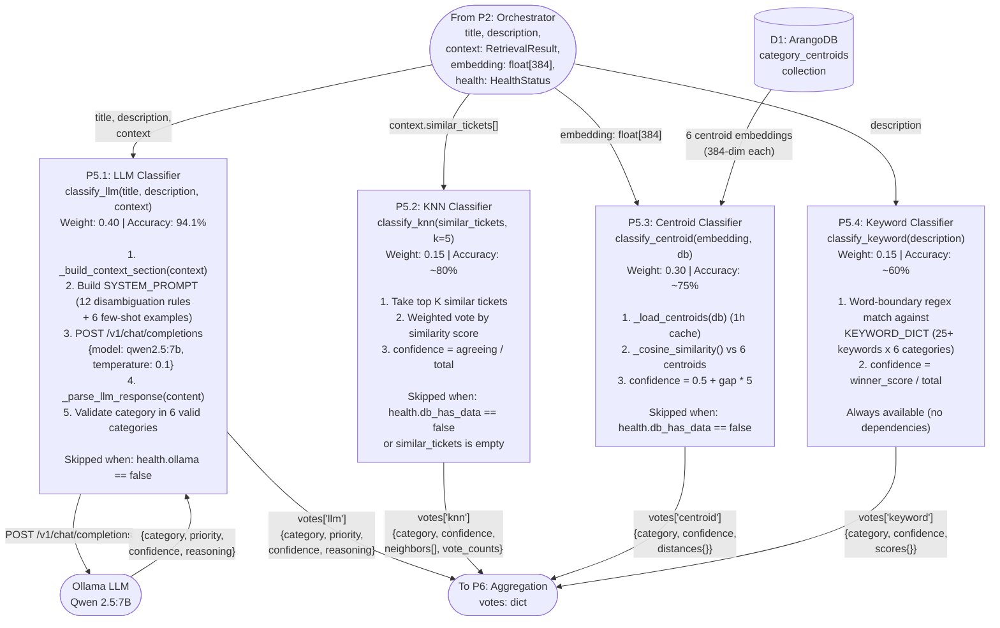

# DeskMind — Data Flow Diagrams

> **Nasscom AI-Code-Sarathi Excel Hackathon — Final Round (Jury)**
> **Team**: Arif Asadullah, Aakarsh, Mohit Tomar
> **Date**: June 2026

---

## 1. Context Diagram (Level 0)

The Context Diagram shows DeskMind as a single process, with all external entities
that produce data for or consume data from the system.



### External Entity Summary

| Entity | Type | Data Produced | Data Consumed |
|--------|------|---------------|---------------|
| IT Staff / End User | Human actor | Ticket text, status updates, resolutions | Routed ticket, AI reasoning, suggested fixes |
| React Frontend | Application | HTTP requests (POST, GET, PATCH) | TicketResponse JSON |
| Ollama (Qwen 2.5:7B) | LLM service | Classification JSON (category, priority, confidence, reasoning) | Prompt with ticket text + retrieval context |
| ArangoDB 3.12 | Database | Documents, edges, vectors, graph traversal results | AQL queries, document inserts, edge creation |
| Redis 7 | Cache | Cached health status, cached entity lists | Health check results, entity lists |

---

## 2. Level 1 Data Flow Diagram

Level 1 decomposes the DeskMind system into its 7 core processes, connected by
data flows and backed by 4 data stores.



### Process Summary

| Process | Source File | Key Functions | Input | Output |
|---------|------------|---------------|-------|--------|
| P1: API Layer | `tickets.py` | `create_ticket()`, `list_tickets()`, `update_ticket_status()`, `resolve_ticket()` | HTTP request + TicketCreate | TicketResponse JSON |
| P2: Orchestrator | `orchestrator.py` | `classify()`, `check_health()` | title, description, db, redis_client | ClassificationResult (17 fields) |
| P3: Preparation | `entity_extractor.py`, `quality_scorer.py`, `orchestrator.py` | `entity_extractor.extract()`, `score_quality()`, `get_embedding_model().encode()` | Ticket text, db | Entities, quality score, 384-dim embedding |
| P4: Retrieval | `retrieval.py` | `retrieve_all()` (calls 4 search functions) | embedding, entities, description, db | RetrievalResult (4 result sets) |
| P5: Classification | `llm_classifier.py`, `knn_classifier.py`, `centroid_classifier.py`, `keyword_classifier.py` | `classify_llm()`, `classify_knn()`, `classify_centroid()`, `classify_keyword()` | Ticket text, context, embedding, similar tickets | votes dict (up to 4 classifier results) |
| P6: Aggregation | `aggregator.py`, `error_scanner.py` | `aggregate()`, `_get_weights()`, `errors_confirm_category()` | votes, quality, error codes, graph confirmation | Final category, confidence, agreement, reasoning |
| P7: Decision | `orchestrator.py` | `lookup_team()`, `find_runbook()`, resolution ranking | category, priority, context | Team, resolution, runbook, expert |

---

## 3. Level 2 DFD — Retrieval Subsystem (P4)

The Retrieval stage runs 4 independent searches. Each search can fail without
blocking the others.



### Retrieval Method Details

| Method | Function | AQL Pattern | Data Traversal | Output Fields |
|--------|----------|-------------|----------------|---------------|
| Vector Similarity | `search_similar_tickets(db, embedding, limit=5)` | Primary: `SORT APPROX_NEAR_COSINE(t.embedding, @embedding) DESC LIMIT @overfetch` (ANN vector index), then `FILTER status IN ["closed", "resolved"]` and recompute exact `COSINE_SIMILARITY` on the survivors. Brute-force `COSINE_SIMILARITY` full-scan is the fallback only (when the index is unavailable). Including resolved tickets creates a live feedback loop where engineer resolutions improve future suggestions. | `tickets` -> `resolved_with` -> `resolutions` | key, title, category, priority, description (200 chars), similarity, resolution_steps, effectiveness |
| Error Code Match | `search_by_error_codes(db, error_codes)` | `1..1 OUTBOUND error_codes triggered_by` per matched error code | `error_codes` -> `triggered_by` -> `tickets` -> `resolved_with` -> `resolutions` | key, title, category, error_code, resolution_steps, effectiveness |
| Graph Traversal | `traverse_graph(db, entities)` | Multi-hop: server -> hosts -> services, server -> managed_by -> teams, teams <- member_of <- engineers | `servers` -> `hosts` -> `services`, `servers` -> `managed_by` -> `teams`, `teams` <- `member_of` <- `engineers`, `servers` <- `affects` <- `tickets` | server_type, datacenter, team, domain, services, past_tickets, experts |
| Full-text Search | `search_fulltext(db, text, limit=5)` | `FULLTEXT(tickets, "description", @term)` per keyword (up to 5 terms, len > 3) | `tickets` fulltext index | key, title, category, description (150 chars) |

---

## 4. Level 2 DFD — Classification Subsystem (P5)

The Classification stage runs up to 4 independent classifiers. Availability depends
on the current degradation level.



### Classifier Availability by Degradation Level

| Level | Name | Ollama | DB Data | Active Classifiers | Weights |
|-------|------|--------|---------|-------------------|---------|
| 4 | Full | Up | Has data | LLM + KNN + Centroid + Keyword | 0.40, 0.15, 0.30, 0.15 |
| 3 | No Data | Up | Empty | LLM + Keyword | 0.80, 0.20 |
| 2 | No LLM | Down | Has data | KNN + Centroid + Keyword | 0.25, 0.50, 0.25 |
| 1 | Emergency | Down | Empty | Keyword only | 1.00 |

### Classifier Output Schemas

**LLM (`classify_llm`):**
```json
{
  "category": "Database",
  "priority": "high",
  "confidence": 0.94,
  "reasoning": "PostgreSQL connection pool exhausted..."
}
```

**KNN (`classify_knn`):**
```json
{
  "category": "Database",
  "confidence": 0.80,
  "neighbors": [
    {"key": "T-001", "title": "DB connection timeout...", "category": "Database", "similarity": 0.95}
  ],
  "vote_counts": {"Database": 4, "Application": 1}
}
```

**Centroid (`classify_centroid`):**
```json
{
  "category": "Database",
  "confidence": 0.84,
  "distances": {"Database": 0.92, "Infrastructure": 0.65, "Application": 0.61, "Network": 0.55, "Security": 0.43, "Access Management": 0.40}
}
```

**Keyword (`classify_keyword`):**
```json
{
  "category": "Database",
  "confidence": 0.75,
  "scores": {"Database": 3, "Application": 1, "Infrastructure": 0, "Network": 0, "Security": 0, "Access Management": 0}
}
```

---

## 5. Data Store Schema Summary

### Document Collections (15)

| Collection | Key Fields | Records | Purpose |
|------------|-----------|---------|---------|
| `tickets` | _key, title, description, category, priority, status, confidence_score, embedding[384], ai_reasoning, classifier_votes, routed_to, _source | 855 | All tickets (seed + synthetic + user) |
| `teams` | _key, name, domain, email, escalation_email | 6 | IT support teams |
| `engineers` | _key, name, role, expertise, email, team | 12 | Team members |
| `servers` | _key, type, datacenter, os, status | 15 | Infrastructure servers |
| `services` | _key, name, type, port, server | 12 | Software services |
| `network_devices` | _key, type, location, model | varies | Network hardware |
| `error_codes` | _key, pattern, service, severity, description | 20 | Known error patterns |
| `runbooks` | _key, title, category, steps[] | 10 | Standard operating procedures |
| `resolutions` | _key, steps[], effectiveness, embedding[384] | 30 | Past resolution records (seed; grows as tickets are resolved) |
| `routing_rules` | _key, category, priority, target_team, is_active | 24 | Category+priority to team mapping |
| `audit_log` | _key, ticket_id, action, actor, old_value, new_value, confidence_score, confidence_signals, reasoning, created_at | growing | Full audit trail |
| `category_centroids` | _key, category, embedding[384], ticket_count | 6 | Average embedding per category |
| `users` | _key, email (unique), password_hash, role, first_name, last_name, engineer_key, team_key, is_active | growing | Authentication accounts (RBAC) |
| `corrections` | _key, ticket_id, original_category, corrected_category, original_priority, corrected_priority, classifier_votes, classifiers_wrong, classifiers_right, corrected_by, corrector_role, reason, is_trusted, embedding, created_at | growing | Human correction feedback (which classifiers were wrong/right) |
| `repeated_issues` | _key, ticket_ids[], ticket_titles[], count, category, representative_title, center_embedding[384], first_seen, last_seen, detected_at | growing | Detected recurring-issue clusters |

### Edge Collections (9)

| Edge Collection | _from | _to | Meaning |
|----------------|-------|-----|---------|
| `hosts` | servers | services | Server hosts this service |
| `managed_by` | servers | teams | Team manages this server |
| `depends_on` | services | services | Service depends on another service |
| `member_of` | engineers | teams | Engineer belongs to this team |
| `affects` | tickets | servers | Ticket affects this server |
| `assigned_to` | tickets | teams | Ticket assigned to this team |
| `resolved_with` | tickets | resolutions | Ticket resolved with these steps |
| `references` | resolutions | runbooks | Resolution used this runbook |
| `triggered_by` | error_codes | tickets | Error code triggered this ticket |

### Key Indexes

| Index Type | Collection.Field | Details |
|------------|-----------------|---------|
| Vector | `tickets.embedding` | 384 dimensions, cosine metric, APPROX_NEAR_COSINE |
| Fulltext | `tickets.description` | Term-level keyword matching |
| Persistent | `tickets.status` | Fast filter on closed/open/routed |
| Persistent | `routing_rules.category` | Fast routing rule lookup |
| Persistent | `routing_rules.priority` | Fast routing rule lookup |
| Persistent (unique) | `users.email` | Fast login lookup, prevent duplicates |

---

## 6. End-to-End Data Trace

This section traces a concrete ticket through every stage of the pipeline,
showing the exact data transformations at each step.

### Input Ticket

```
Title: "PostgreSQL connection pool exhausted on db-primary-01"
Description: "Getting FATAL: too many connections for role 'order_svc'.
              Connection pool on db-primary-01 maxed out at 100.
              Order service returning 503 errors since 14:30 UTC."
```

### Stage 1 -- Preparation

**entity_extractor.extract(description, db):**
```
ExtractedEntities {
  servers: ["db-primary-01"],
  services: ["postgresql", "order-service"],
  error_codes: [
    { error_key: "ERR-DB-003", pattern: "too many connections",
      service: "postgresql", severity: "high" }
  ]
}
```

**score_quality(title, description, entities):**
```
desc_len = 183 (> 50)  -->  true
has_entities = true     -->  servers found
has_errors = true       -->  error code matched
Result: "HIGH"          -->  confidence cap = 0.99
```

**get_embedding_model().encode(description):**
```
embedding: float[384] = [0.0231, -0.0145, 0.0892, ..., -0.0034]
```

### Stage 2 -- Retrieval

**search_similar_tickets(db, embedding, limit=5):**
```
similar_tickets: [
  { key: "T-042", title: "PostgreSQL max connections exceeded",
    category: "Database", similarity: 0.94,
    resolution_steps: ["Increase max_connections to 200", "Restart PostgreSQL"] },
  { key: "T-118", title: "Connection pool timeout on db-primary-01",
    category: "Database", similarity: 0.91, resolution_steps: [...] },
  ...3 more
]
```

**search_by_error_codes(db, error_codes):**
```
error_matched_tickets: [
  { key: "T-042", title: "PostgreSQL max connections exceeded",
    category: "Database", error_code: "ERR-DB-003",
    resolution_steps: ["Increase max_connections", ...], effectiveness: 0.95 }
]
```

**traverse_graph(db, entities):**
```
GraphContext {
  server_type: "database",
  server_datacenter: "us-east-1a",
  managed_by_team: "Database Admin",
  managed_by_domain: "Database",
  hosted_services: ["postgresql", "pgbouncer"],
  dependent_services: ["order-service", "auth-service"],
  past_tickets_on_server: [
    { key: "T-042", title: "PostgreSQL max connections exceeded",
      category: "Database", resolution_steps: [...], effectiveness: 0.95 }
  ],
  experts: [
    { name: "Priya Sharma", role: "DBA Lead", expertise: "PostgreSQL" },
    { name: "Raj Kumar", role: "DBA", expertise: "Replication" }
  ]
}
```

**search_fulltext(db, description, limit=5):**
```
fulltext_matches: [
  { key: "T-042", title: "PostgreSQL max connections exceeded",
    category: "Database", description: "FATAL: too many connections..." },
  { key: "T-203", title: "Connection pool sizing issue",
    category: "Database", description: "Pool exhausted during peak..." }
]
```

### Stage 3 -- Classification (Parallel via `asyncio.gather`)

All 4 classifiers run concurrently — total Stage 3 time = max(individual times) ≈ LLM time.

**classify_llm(title, description, context):**
```
{ category: "Database", priority: "critical", confidence: 0.96,
  reasoning: "Root cause is PostgreSQL connection pool exhaustion on db-primary-01.
              The server is a database server managed by Database Admin team.
              Past tickets on this server confirm Database category." }
```

**classify_knn(similar_tickets, k=5):**
```
{ category: "Database", confidence: 0.80,
  neighbors: [...5 tickets, 4 Database + 1 Application],
  vote_counts: { "Database": 4, "Application": 1 } }
```

**classify_centroid(embedding, db):**
```
{ category: "Database", confidence: 0.87,
  distances: { "Database": 0.92, "Application": 0.61, "Infrastructure": 0.58,
               "Network": 0.45, "Security": 0.38, "Access Management": 0.35 } }
```

**classify_keyword(description):**
```
{ category: "Database", confidence: 0.60,
  scores: { "Database": 3, "Application": 2, "Infrastructure": 0,
            "Network": 0, "Security": 0, "Access Management": 0 } }
```

### Stage 4 -- Aggregation

**aggregate(votes, quality_score="HIGH", error_codes=[...], graph_confirms_category=True):**

`aggregate()` is a 6-phase, majority-aware voting algorithm. It selects a winner by
counting votes (not by summing weights), then derives confidence from a fixed
formula. There is no agreement bonus and no calibration multiplier.

```
Phase routing (which branch fires):
  Phase 0  single classifier active
  Phase 1  unanimous (all active classifiers agree)        <-- this ticket: 4/4
  Phase 2  supermajority (3+ agree, strength-gated)
  Phase 3  pair beats singles (2/1/1)
  Phase 4  2v2 split (Database/Infrastructure boundary override,
           else weighted / avg-conf / centroid tiebreak)
  Phase 5  total disagreement (weighted fallback)

Winner selection -- sort categories by (vote_count desc, weighted_score desc, name asc):
  Database     4 votes  (LLM, KNN, Centroid, Keyword)  -->  winner
  scenario = unanimous_4  -->  scenario_cap = 0.95

Confidence formula:
  supporter_avg_conf = (0.96 + 0.80 + 0.87 + 0.60) / 4 = 0.8075
  vote_share         = 4 / 4 = 1.0
  weight_share       = (0.40 + 0.15 + 0.30 + 0.15) / 1.00 = 1.0

  base = 0.60 * 0.8075 + 0.25 * 1.0 + 0.15 * 1.0 = 0.8845

Contextual bonuses:
  errors_confirm_category(["ERR-DB-003"], "Database") = true  -->  +0.03
  graph_confirms_category = true                              -->  +0.02
  bonus = +0.05
  base + bonus = 0.8845 + 0.05 = 0.9345

Safety check (low-confidence cap):
  max_supporter_conf = 0.96 >= 0.60 (and >= 3 classifiers active)  -->  not capped
  (If max_supporter_conf < 0.60 with >= 3 active classifiers, base is capped at 0.55.)

Apply caps -- final = round(min(base + bonus, SCENARIO_CAP, QUALITY_CAP), 3):
  min(0.9345, unanimous_4 cap 0.95, HIGH cap 0.99) = 0.9345
  final_confidence = round(0.9345, 3) = 0.934

Result:
  { category: "Database", secondary_category: null, priority: "critical",
    confidence: 0.934, agreement: "4/4", quality_score: "HIGH" }
```

### Stage 5 -- Decision & Enrichment

```
confidence = 0.934 >= 0.70  -->  status = "routed"

lookup_team(db, "Database", "critical")  -->  "Database Admin"
find_runbook(db, "Database", [...])      -->  "KB-0001: PostgreSQL connection limit exceeded"
  (relevance-gated: a runbook is returned only when its title shares >=1
   meaningful word with the ticket text; otherwise None and no runbook is shown)

Best resolution (from 3 sources, highest effectiveness):
  Source 2 (error match): T-042, effectiveness = 0.95
  suggested_resolution = ["Increase max_connections to 200", "Restart PostgreSQL"]
  resolution_effectiveness = 0.95

recommended_expert = "Priya Sharma" (first expert from graph)
```

### Final ClassificationResult

```python
ClassificationResult(
    category="Database",
    secondary_category=None,
    priority="critical",
    confidence=0.934,
    agreement="4/4",
    quality_score="HIGH",
    classifier_votes={
        "llm":      {"category": "Database", "confidence": 0.96, ...},
        "knn":      {"category": "Database", "confidence": 0.80, ...},
        "centroid": {"category": "Database", "confidence": 0.87, ...},
        "keyword":  {"category": "Database", "confidence": 0.60, ...},
    },
    reasoning="Root cause is PostgreSQL connection pool exhaustion...",
    degradation_level=4,
    embedding=[0.0231, -0.0145, ...],   # 384 floats
    suggested_resolution=["Increase max_connections to 200", "Restart PostgreSQL"],
    resolution_effectiveness=0.95,
    suggested_runbook="KB-0001: PostgreSQL connection limit exceeded",
    recommended_team="Database Admin",
    recommended_expert="Priya Sharma",
    processing_time_ms=2847,
)
```

---

## 7. Data Volume and Timing Table

### Per-Stage Data Volumes

| Stage | Process | Input Size | Output Size | DB Queries | Edge Traversals |
|-------|---------|-----------|-------------|------------|-----------------|
| Stage 1: Prepare | entity_extractor.extract() | ~200 chars text | 3 lists (servers, services, errors) | 3 collection scans (cached) | 0 |
| Stage 1: Prepare | score_quality() | title + description + entities | 1 string: HIGH/MEDIUM/LOW | 0 | 0 |
| Stage 1: Prepare | model.encode() | ~200 chars text | 384 floats (1.5 KB) | 0 | 0 |
| Stage 2: Retrieve | search_similar_tickets() | 384 floats | up to 5 SimilarTicket dicts | 1 AQL (vector + join) | 5 resolved_with |
| Stage 2: Retrieve | search_by_error_codes() | up to 20 error keys | up to 20 matched tickets | N AQL (1 per error code) | N triggered_by + N resolved_with |
| Stage 2: Retrieve | traverse_graph() | server keys, service keys | 1 GraphContext dict | 1 AQL (multi-hop) | hosts + managed_by + affects + member_of + depends_on |
| Stage 2: Retrieve | search_fulltext() | up to 5 keywords | up to 5 matched tickets | up to 5 AQL (1 per term) | 0 |
| Stage 3: Classify | classify_llm() | ~500 chars prompt | 1 JSON object | 0 (HTTP to Ollama) | 0 |
| Stage 3: Classify | classify_knn() | 5 similar tickets | 1 vote dict | 0 | 0 |
| Stage 3: Classify | classify_centroid() | 384 floats + 6 centroids | 1 vote dict + 6 distances | 1 collection scan (cached) | 0 |
| Stage 3: Classify | classify_keyword() | ~200 chars text | 1 vote dict + 6 scores | 0 | 0 |
| Stage 4: Aggregate | aggregate() | up to 4 vote dicts | 1 result dict | 0 | 0 |
| Stage 5: Decide | lookup_team() + find_runbook() | category, priority | team name, runbook ref | 2 AQL queries | 0 |
| Post-pipeline | Insert ticket + edges + audit | ClassificationResult | 1 doc + 1 edge + 1 audit | 3 inserts | 1 assigned_to |

### Timing Breakdown (Typical)

| Stage | Component | Typical Latency | Notes |
|-------|-----------|----------------|-------|
| Health Check | check_health() | < 1 ms (cached) / ~50 ms (fresh) | Cached for 5 seconds |
| Stage 1 | entity_extractor.extract() | ~5 ms | String matching against cached lists |
| Stage 1 | score_quality() | < 1 ms | Pure computation |
| Stage 1 | model.encode() | ~50-100 ms | MiniLM inference (CPU) |
| Stage 2 | search_similar_tickets() | ~20-40 ms | AQL vector similarity on 855 docs |
| Stage 2 | search_by_error_codes() | ~10-20 ms | Edge traversal per error code |
| Stage 2 | traverse_graph() | ~15-30 ms | Multi-hop AQL traversal |
| Stage 2 | search_fulltext() | ~10-20 ms | Fulltext index lookup per term |
| Stage 3 | classify_llm() | **5,000-7,000 ms** | Qwen 2.5:7B inference via Ollama |
| Stage 3 | classify_knn() | ~1 ms | Pure math on 5 tickets |
| Stage 3 | classify_centroid() | ~2 ms | 6 cosine similarity calculations |
| Stage 3 | classify_keyword() | ~1 ms | String matching against 150+ keywords |
| Stage 4 | aggregate() | < 1 ms | Weighted arithmetic |
| Stage 5 | lookup_team() + find_runbook() | ~5-10 ms | 2 AQL queries |
| Post-pipeline | DB inserts (ticket + edge + audit) | ~10-20 ms | 3 document inserts |
| **Total** | **End-to-end** | **~5,000-7,000 ms** | **Classifiers run in parallel (asyncio.gather) — LLM dominates** |
| **Level 2 (No LLM)** | **Without classify_llm()** | **~150-300 ms** | **Sub-second without LLM** |

### Data Volume Summary

| Metric | Value |
|--------|-------|
| Total documents in ArangoDB | ~1,800 (approximate, at seed time; grows with usage) |
| Total edges in ArangoDB | ~3,500 (generated at seed time; grows with usage) |
| Embedding dimensions | 384 (MiniLM all-MiniLM-L6-v2) |
| Embedding size per ticket | ~1.5 KB (384 x 4 bytes) |
| Average ticket description | ~150-300 characters |
| Max retrieval context passed to LLM | ~2,000 characters |
| Category centroids | 6 (one per IT domain) |
| Keyword dictionary | 150+ keywords across 6 categories |
| Routing rules | 24 (6 categories x 4 priorities) |

---

## 8. Data Flow Notation Key

| Symbol | Meaning |
|--------|---------|
| Rectangle with rounded corners | Process (function or service) |
| Cylinder | Data store (database, cache, model) |
| Stadium shape | External entity or data interface |
| Solid arrow | Data flow with label describing content |
| `[n]` in collection name | Number of records at seed time |
