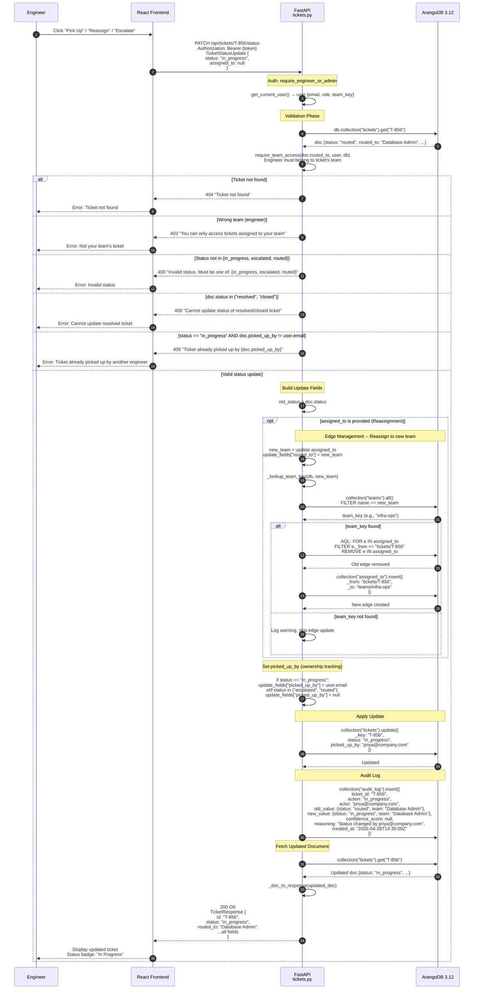
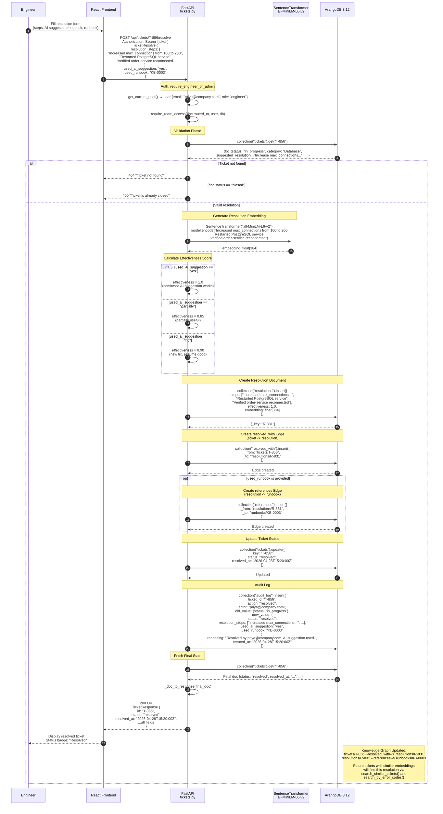
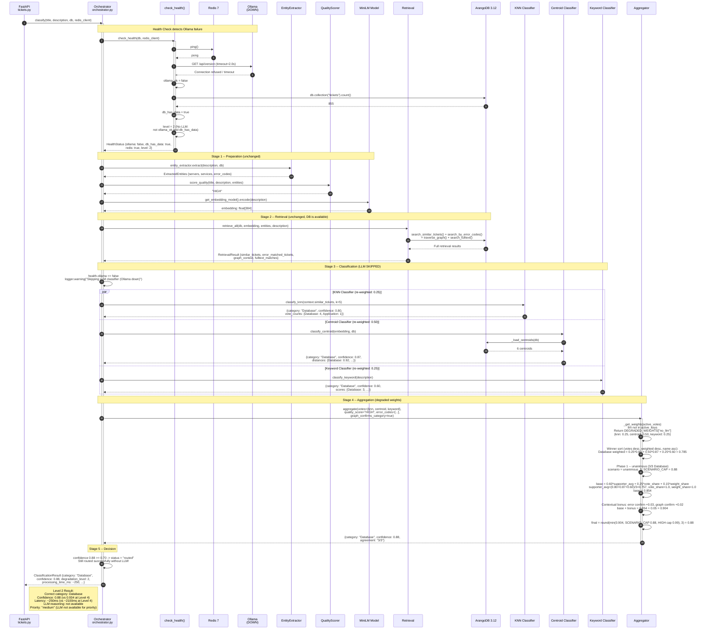
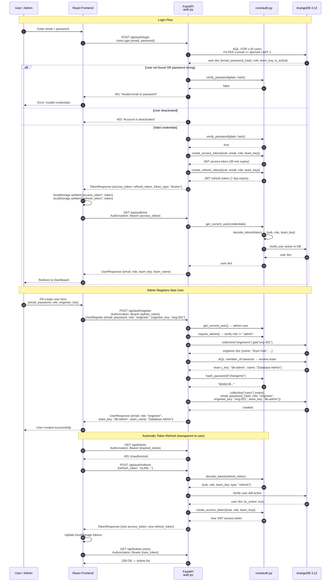

# DeskMind — Sequence Diagrams

> **Nasscom AI-Code-Sarathi Excel Hackathon — Final Round (Jury)**
> **Team**: Arif Asadullah, Aakarsh, Mohit Tomar
> **Date**: June 2026

---

## 1. Ticket Submission and Classification (Full Pipeline)

This diagram shows the complete end-to-end flow when a user submits a ticket
through the React frontend. It covers all 5 stages of the classification pipeline,
including parallel retrieval searches, parallel classifier execution, aggregation,
and the final routing decision.

```mermaid
sequenceDiagram
    autonumber
    participant User as IT Staff / User
    participant React as React Frontend
    participant API as FastAPI<br/>tickets.py
    participant Orch as Orchestrator<br/>orchestrator.py
    participant Health as check_health()
    participant Redis as Redis 7
    participant EE as EntityExtractor<br/>entity_extractor.py
    participant QS as QualityScorer<br/>quality_scorer.py
    participant MM as MiniLM Model<br/>all-MiniLM-L6-v2
    participant Ret as Retrieval<br/>retrieval.py
    participant ArangoDB as ArangoDB 3.12
    participant LLM as LLM Classifier<br/>llm_classifier.py
    participant Ollama as Ollama<br/>Qwen 2.5:7B
    participant KNN as KNN Classifier<br/>knn_classifier.py
    participant Cent as Centroid Classifier<br/>centroid_classifier.py
    participant KW as Keyword Classifier<br/>keyword_classifier.py
    participant Agg as Aggregator<br/>aggregator.py

    User ->> React: Submit ticket form<br/>(title, description, priority)
    React ->> API: POST /api/tickets<br/>Authorization: Bearer {token}<br/>TicketCreate {title, description, priority}

    Note over API: Auth: require_any_authenticated
    API ->> API: get_current_user() → user {email, role, team_key}
    API ->> API: Validate request via Pydantic<br/>submitted_by = user.email (from token)

    Note over API, Orch: Stage 0 -- Invoke Classification Pipeline
    API ->> Orch: classify(title, description, db, redis_client)
    activate Orch

    Note over Orch, Redis: Health Check (cached 5s TTL)
    Orch ->> Health: check_health(db, redis_client)
    activate Health
    Health ->> Redis: ping()
    Redis -->> Health: pong (redis_ok=true)
    Health ->> Ollama: GET /api/version
    Ollama -->> Health: 200 OK (ollama_ok=true)
    Health ->> ArangoDB: db.collection("tickets").count()
    ArangoDB -->> Health: 855 (db_has_data=true)
    Health -->> Orch: HealthStatus {ollama: true, db_has_data: true, redis: true, level: 4}
    deactivate Health

    Note over Orch, MM: Stage 1 -- Preparation
    Orch ->> EE: entity_extractor.extract(description, db)
    activate EE
    EE ->> EE: refresh_cache(db)<br/>Check CACHE_TTL (300s)
    EE ->> ArangoDB: collection("servers").all()<br/>collection("services").all()<br/>collection("error_codes").all()
    ArangoDB -->> EE: 15 server keys, 12 service keys,<br/>20 error patterns
    EE ->> EE: Match servers in text_lower<br/>Match services by key/name<br/>Match error patterns
    EE -->> Orch: ExtractedEntities {servers: ["db-primary-01"],<br/>services: ["postgresql"], error_codes: [{error_key: "ERR-DB-003", ...}]}
    deactivate EE

    Orch ->> QS: score_quality(title, description, entities)
    activate QS
    QS ->> QS: desc_len=183 > 50, has_entities=true,<br/>has_errors=true
    QS -->> Orch: "HIGH"
    deactivate QS

    Orch ->> MM: get_embedding_model().encode(description)
    activate MM
    MM -->> Orch: embedding: float[384]
    deactivate MM

    Note over Orch, ArangoDB: Stage 2 -- Retrieval (4 searches)
    Orch ->> Ret: retrieve_all(db, embedding, entities, description)
    activate Ret

    par Vector Similarity Search
        Ret ->> ArangoDB: search_similar_tickets(db, embedding, limit=5)<br/>AQL (primary): subquery SORT APPROX_NEAR_COSINE DESC LIMIT overfetch,<br/>then FILTER status IN ['closed','resolved'], recompute exact COSINE_SIMILARITY<br/>(brute-force COSINE_SIMILARITY full-scan is fallback only)<br/>+ resolved_with traversal
        ArangoDB -->> Ret: similar_tickets: list[SimilarTicket] (5 results)
    and Error Code Match
        Ret ->> ArangoDB: search_by_error_codes(db, error_codes)<br/>AQL: 1..1 OUTBOUND error_codes triggered_by<br/>+ resolved_with traversal
        ArangoDB -->> Ret: error_matched_tickets: list[dict]
    and Graph Traversal
        Ret ->> ArangoDB: traverse_graph(db, entities)<br/>AQL: server -> hosts -> services<br/>server -> managed_by -> teams<br/>teams <- member_of <- engineers<br/>server <- affects <- tickets
        ArangoDB -->> Ret: GraphContext {managed_by_team: "Database Admin",<br/>managed_by_domain: "Database",<br/>experts: [{name: "Priya Sharma", ...}], ...}
    and Full-text Search
        Ret ->> ArangoDB: search_fulltext(db, description, limit=5)<br/>AQL: FULLTEXT(tickets, "description", @term)<br/>per keyword (up to 5 terms)
        ArangoDB -->> Ret: fulltext_matches: list[dict]
    end

    Ret -->> Orch: RetrievalResult {similar_tickets,<br/>error_matched_tickets, graph_context, fulltext_matches}
    deactivate Ret

    Note over Orch, KW: Stage 3 -- Classification (4 classifiers in parallel via asyncio.gather)
    par LLM Classifier (weight: 0.40)
        Orch ->> LLM: classify_llm(title, description, context)
        activate LLM
        LLM ->> LLM: _build_context_section(context)<br/>Build SYSTEM_PROMPT + user_prompt
        LLM ->> Ollama: POST /v1/chat/completions<br/>{model: "qwen2.5:7b",<br/>messages: [system, user],<br/>temperature: 0.1}
        Ollama -->> LLM: {choices: [{message: {content: "JSON..."}}]}
        LLM ->> LLM: _parse_llm_response(content)<br/>Validate category in 6 valid_cats<br/>Validate priority in valid_pris<br/>Clamp confidence to [0.0, 1.0]
        LLM -->> Orch: {category: "Database", priority: "critical",<br/>confidence: 0.96, reasoning: "Root cause is..."}
        deactivate LLM
    and KNN Classifier (weight: 0.15)
        Orch ->> KNN: classify_knn(context.similar_tickets, k=5)
        activate KNN
        KNN ->> KNN: Take top K tickets<br/>Weighted vote by similarity<br/>confidence = agreeing / total
        KNN -->> Orch: {category: "Database", confidence: 0.80,<br/>vote_counts: {Database: 4, Application: 1}}
        deactivate KNN
    and Centroid Classifier (weight: 0.30)
        Orch ->> Cent: classify_centroid(embedding, db)
        activate Cent
        Cent ->> Cent: _load_centroids(db) (1h cache)
        Cent ->> ArangoDB: collection("category_centroids").all()
        ArangoDB -->> Cent: 6 centroid embeddings
        Cent ->> Cent: _cosine_similarity() vs 6 centroids<br/>confidence = 0.5 + gap * 5
        Cent -->> Orch: {category: "Database", confidence: 0.87,<br/>distances: {Database: 0.92, ...}}
        deactivate Cent
    and Keyword Classifier (weight: 0.15)
        Orch ->> KW: classify_keyword(description)
        activate KW
        KW ->> KW: Match KEYWORD_DICT<br/>(25+ keywords x 6 categories)<br/>confidence = winner / total
        KW -->> Orch: {category: "Database", confidence: 0.60,<br/>scores: {Database: 3, Application: 2, ...}}
        deactivate KW
    end

    Note over Orch, Agg: Stage 4 -- Aggregation
    Orch ->> Orch: graph_confirms = (graph_context.managed_by_domain == llm_category)
    Orch ->> Agg: aggregate(votes, quality_score="HIGH",<br/>error_codes=[{error_key: "ERR-DB-003", ...}],<br/>graph_confirms_category=true)
    activate Agg
    Agg ->> Agg: _get_weights(active_votes)<br/>{llm: 0.40, knn: 0.15, centroid: 0.30, keyword: 0.15}
    Agg ->> Agg: Phase select (6-phase majority-aware voting):<br/>all 4 classifiers vote Database -> Phase 1 unanimous<br/>scenario = unanimous_4 (SCENARIO_CAP = 0.95)
    Agg ->> Agg: Winner: sort by (vote_count desc, weighted_score desc, name asc)<br/>Database = 4 votes -> winner
    Agg ->> Agg: Confidence base = 0.60*supporter_avg + 0.25*vote_share + 0.15*weight_share<br/>supporter_avg = (0.96+0.80+0.87+0.60)/4 = 0.8075<br/>vote_share = 4/4 = 1.0, weight_share = 1.0<br/>base = 0.60*0.8075 + 0.25*1.0 + 0.15*1.0 = 0.8845
    Agg ->> Agg: Contextual bonus: errors_confirm_category() -> +0.03<br/>graph_confirms -> +0.02<br/>base + bonus = 0.8845 + 0.05 = 0.9345
    Agg ->> Agg: Safety: max_supporter_conf=0.96 >= 0.60 -> no 0.55 cap
    Agg ->> Agg: final = round(min(0.9345, SCENARIO_CAP 0.95, QUALITY_CAP HIGH 0.99), 3) = 0.934
    Agg -->> Orch: {category: "Database", secondary_category: null,<br/>priority: "critical", confidence: 0.934,<br/>agreement: "4/4", quality_score: "HIGH"}
    deactivate Agg

    Note over Orch, ArangoDB: Stage 5 -- Decision & Enrichment
    Orch ->> ArangoDB: lookup_team(db, "Database", "critical")<br/>AQL: routing_rules FILTER category+priority<br/>JOIN teams
    ArangoDB -->> Orch: "Database Admin"
    Orch ->> Orch: Select best resolution from 3 sources<br/>Source 1: similar_tickets (same category)<br/>Source 2: error_matched_tickets (highest effectiveness)<br/>Source 3: graph past_tickets_on_server
    Orch ->> ArangoDB: find_runbook(db, "Database", resolution_steps)<br/>AQL: runbooks FILTER category
    ArangoDB -->> Orch: "KB-0003: PostgreSQL Emergency Recovery"
    Orch ->> Orch: recommended_expert = graph_context.experts[0].name<br/>= "Priya Sharma"

    Orch -->> API: ClassificationResult {category: "Database",<br/>confidence: 0.934, recommended_team: "Database Admin",<br/>suggested_resolution: [...], recommended_expert: "Priya Sharma",<br/>processing_time_ms: 2147, ...17 fields total}
    deactivate Orch

    Note over API, ArangoDB: Post-Pipeline -- Persist & Respond

    alt confidence >= 0.70 (Auto-route)
        API ->> API: status = "routed"
    else confidence < 0.70 (Escalate)
        API ->> API: status = "escalated"
    end

    API ->> ArangoDB: collection("tickets").insert({<br/>title, description, category: "Database",<br/>priority: "critical", status: "routed",<br/>confidence_score: 0.934, embedding: float[384],<br/>routed_to: "Database Admin",<br/>suggested_resolution: ["Increase max_connections..."],<br/>resolution_effectiveness: 0.95,<br/>suggested_runbook: "KB-0003: PostgreSQL Emergency Recovery",<br/>recommended_expert: "Priya Sharma",<br/>_source: "user", ...})
    ArangoDB -->> API: {_key: "T-856"}
    Note right of ArangoDB: AI enrichment fields (suggested_resolution,<br/>resolution_effectiveness, suggested_runbook,<br/>recommended_expert) are stored directly<br/>in the ticket document — not just<br/>returned in the API response.

    API ->> API: _lookup_team_key(db, "Database Admin")
    API ->> ArangoDB: collection("assigned_to").insert({<br/>_from: "tickets/T-856", _to: "teams/db-admin"})

    API ->> ArangoDB: collection("audit_log").insert({<br/>ticket_id: "T-856", action: "classified",<br/>actor: "ai-4-classifier-ensemble",<br/>new_value: {category: "Database", priority: "critical",<br/>team: "Database Admin"},<br/>confidence_score: 0.934,<br/>confidence_signals: {llm: 0.96, knn: 0.80,<br/>centroid: 0.87, keyword: 0.60}})

    API -->> React: 201 Created<br/>TicketResponse {id: "T-856", category: "Database",<br/>status: "routed", confidence_score: 0.934,<br/>routed_to: "Database Admin",<br/>suggested_resolution: ["Increase max_connections..."],<br/>recommended_expert: "Priya Sharma", ...}
    React -->> User: Display routed ticket with<br/>AI reasoning, confidence, team,<br/>suggested resolution, expert
```



---

## 2. Engineer Status Update (PATCH Flow)

This diagram covers the PATCH `/api/tickets/{id}/status` endpoint, which allows
engineers to pick up tickets, reassign them to different teams, or escalate them.
It includes validation, edge management, and audit logging.



---

## 3. Ticket Resolution (POST Flow)

This diagram covers the POST `/api/tickets/{id}/resolve` endpoint. It shows
how resolution data is persisted, embeddings are generated for future similarity
search, effectiveness scores are calculated, and knowledge graph edges are created
to link the ticket to its resolution and any referenced runbook.



---

## 4. Graceful Degradation Scenarios

DeskMind never goes fully offline. When components fail, the system automatically
detects the degradation level and adjusts classifier weights. This diagram shows
two failure scenarios: Level 2 (Ollama down, DB up) and Level 1 (Emergency mode).

### Scenario A -- Level 2: Ollama Down, Database Available



### Scenario B -- Level 1: Emergency Mode (Ollama Down, Database Empty)

```mermaid
sequenceDiagram
    autonumber
    participant API as FastAPI<br/>tickets.py
    participant Orch as Orchestrator<br/>orchestrator.py
    participant Health as check_health()
    participant Ollama as Ollama<br/>(DOWN)
    participant ArangoDB as ArangoDB 3.12<br/>(EMPTY)
    participant EE as EntityExtractor
    participant QS as QualityScorer
    participant MM as MiniLM Model
    participant KW as Keyword Classifier
    participant Agg as Aggregator

    API ->> Orch: classify(title, description, db, redis_client)
    activate Orch

    Note over Orch, ArangoDB: Health Check -- worst case
    Orch ->> Health: check_health(db, redis_client)
    activate Health
    Health ->> Ollama: GET /api/version (timeout=2.0s)
    Ollama --x Health: Connection refused
    Health ->> Health: ollama_ok = false
    Health ->> ArangoDB: db.collection("tickets").count()
    ArangoDB -->> Health: 0
    Health ->> Health: db_has_data = false
    Health ->> Health: level = 1 (Emergency:<br/>not ollama_ok and not db_has_data)
    Health -->> Orch: HealthStatus {ollama: false, db_has_data: false,<br/>redis: false, level: 1}
    deactivate Health

    Note over Orch, EE: Stage 1 -- Preparation (partial)
    Orch ->> Orch: db exists but db_has_data = false
    Orch ->> EE: entity_extractor.extract(description, db)
    EE ->> EE: refresh_cache(db)<br/>Collections exist but empty
    EE -->> Orch: ExtractedEntities {servers: [], services: [], error_codes: []}

    Orch ->> QS: score_quality(title, description, entities)
    QS ->> QS: desc_len > 50 but has_entities=false, has_errors=false
    QS -->> Orch: "MEDIUM" (cap = 0.85)

    Orch ->> MM: get_embedding_model().encode(description)
    MM -->> Orch: embedding: float[384] (computed but unused)

    Note over Orch: Stage 2 -- Retrieval SKIPPED
    Orch ->> Orch: health.db_has_data == false<br/>context = {similar_tickets: [],<br/>error_matched_tickets: [],<br/>graph_context: null, fulltext_matches: []}

    Note over Orch: Stage 3 -- Only Keyword Classifier available
    Orch ->> Orch: health.ollama == false -> Skip LLM
    Orch ->> Orch: health.db_has_data == false -> Skip KNN
    Orch ->> Orch: health.db_has_data == false -> Skip Centroid

    Orch ->> KW: classify_keyword(description)
    activate KW
    KW ->> KW: Match KEYWORD_DICT<br/>"postgresql" -> Database +1<br/>"connection" -> Database +1<br/>"503" -> Application +1<br/>Database: 2, Application: 1
    KW -->> Orch: {category: "Database", confidence: 0.667,<br/>scores: {Database: 2, Application: 1, ...}}
    deactivate KW

    Note over Orch, Agg: Stage 4 -- Aggregation (emergency weights)
    Orch ->> Agg: aggregate(votes={keyword: {...}},<br/>quality_score="MEDIUM",<br/>error_codes=[], graph_confirms_category=false)
    activate Agg
    Agg ->> Agg: _get_weights(active_votes)<br/>active_keys == {"keyword"}<br/>Return DEGRADED_WEIGHTS["emergency"]<br/>{keyword: 1.0}
    Agg ->> Agg: Phase 0 -- single classifier (only keyword active)<br/>scenario = single_classifier, SCENARIO_CAP = 0.50
    Agg ->> Agg: base = 0.60*supporter_avg + 0.25*vote_share + 0.15*weight_share<br/>= 0.60*0.667 + 0.25*1.0 + 0.15*1.0 = 0.800
    Agg ->> Agg: No error confirmation, no graph confirmation -> bonus = 0<br/>(single classifier, so no &lt;0.60 supporter safety cap either)
    Agg ->> Agg: final = round(min(0.800, SCENARIO_CAP 0.50, MEDIUM cap 0.85), 3) = 0.50
    Agg -->> Orch: {category: "Database", confidence: 0.50,<br/>agreement: "1/1"}
    deactivate Agg

    Note over Orch: Stage 5 -- Decision
    Orch ->> Orch: confidence 0.50 < 0.70 -> status = "escalated"<br/>System correctly escalates to human review

    Orch -->> API: ClassificationResult {category: "Database",<br/>confidence: 0.50, degradation_level: 1,<br/>recommended_team: null (no routing_rules in empty DB),<br/>processing_time_ms: ~120, ...}
    deactivate Orch

    API ->> API: status = "escalated"
    API ->> ArangoDB: collection("tickets").insert({<br/>status: "escalated", confidence_score: 0.50, ...})

    API -->> React: 201 Created<br/>TicketResponse {status: "escalated",<br/>confidence_score: 0.50,<br/>ai_reasoning: "",<br/>routed_to: null}
    React -->> Eng: Display escalated ticket<br/>Banner: "Low confidence -- needs human review"

    Note right of API: Level 1 Emergency Result:<br/>Category suggestion: Database (likely correct)<br/>Confidence: 0.50 (below 0.70 threshold)<br/>Status: ESCALATED to human<br/>Latency: ~120ms (fastest possible)<br/>No resolution, no expert, no runbook<br/>No LLM reasoning<br/><br/>The system never fully crashes --<br/>it always provides a best-effort<br/>classification with appropriate<br/>confidence signaling.
```

### Degradation Summary

| Aspect | Level 4 (Full) | Level 3 (No Data) | Level 2 (No LLM) | Level 1 (Emergency) |
|--------|---------------|-------------------|-------------------|---------------------|
| Classifiers | LLM + KNN + Centroid + Keyword | LLM + Keyword | KNN + Centroid + Keyword | Keyword only |
| Weights | 0.40, 0.15, 0.30, 0.15 | 0.80, 0.20 | 0.25, 0.50, 0.25 | 1.00 |
| Retrieval | All 4 searches | None (no data) | All 4 searches | None (no data) |
| Expected accuracy | ~90%+ | ~80% | ~70% | ~55% |
| Typical latency | 2-5s (parallel) | 2-5s (LLM dominates) | 150-300ms | 50-120ms |
| Resolution suggestion | Yes (3 sources) | No (no past tickets) | Yes (3 sources) | No (no past tickets) |
| Expert recommendation | Yes (from graph) | No (no graph data) | Yes (from graph) | No (no graph data) |
| Auto-route likely? | Yes (high confidence) | Yes (LLM is strong) | Yes (if data-backed) | No (escalates to human) |
| Priority source | LLM inference | LLM inference | Default "medium" | Default "medium" |

---

## 5. Authentication Flow (Login, Register, Token Refresh)

This diagram covers the JWT authentication flow — login, admin registration, and automatic token refresh.



### Authentication Guard on Every Protected Endpoint

Every ticket/chat endpoint goes through this auth check before executing:

```
Request with Bearer token
    │
    ├── get_current_user()
    │       ├── decode_token() → extract {sub, role, team_key}
    │       ├── Query users collection → verify user exists + is_active
    │       └── Return user dict OR raise 401
    │
    ├── require_role() [if endpoint needs specific role]
    │       └── Check user.role in allowed_roles OR raise 403
    │
    └── require_team_access() [inline, for ticket mutations]
            ├── Admin → bypass
            ├── User → 403 "cannot modify"
            └── Engineer → resolve team_key → compare with ticket.routed_to OR raise 403
```

---

## Diagram Notation Reference

| Element | Meaning |
|---------|---------|
| Solid arrow (`->>`) | Synchronous call |
| Dashed arrow (`-->>`) | Return / response |
| Cross arrow (`--x`) | Failed call (connection error / timeout) |
| `par ... and ... end` | Parallel execution block |
| `alt ... else ... end` | Conditional branch |
| `opt ... end` | Optional block (executes only if condition met) |
| `activate` / `deactivate` | Lifespan of an active process |
| `Note over` | Annotation spanning participants |
| `Note right of` | Side annotation on a single participant |
