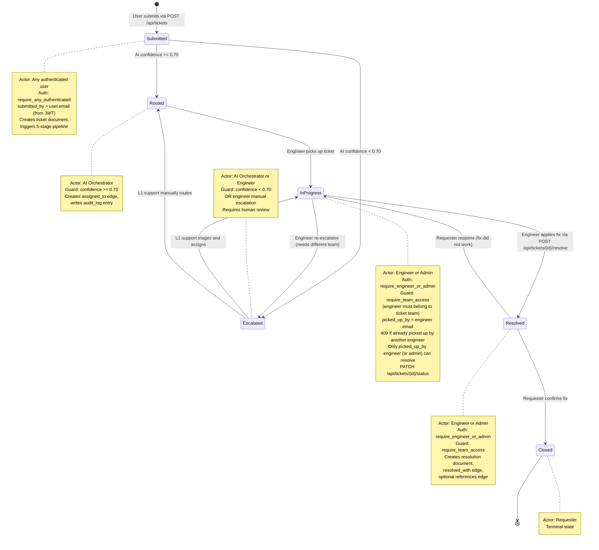
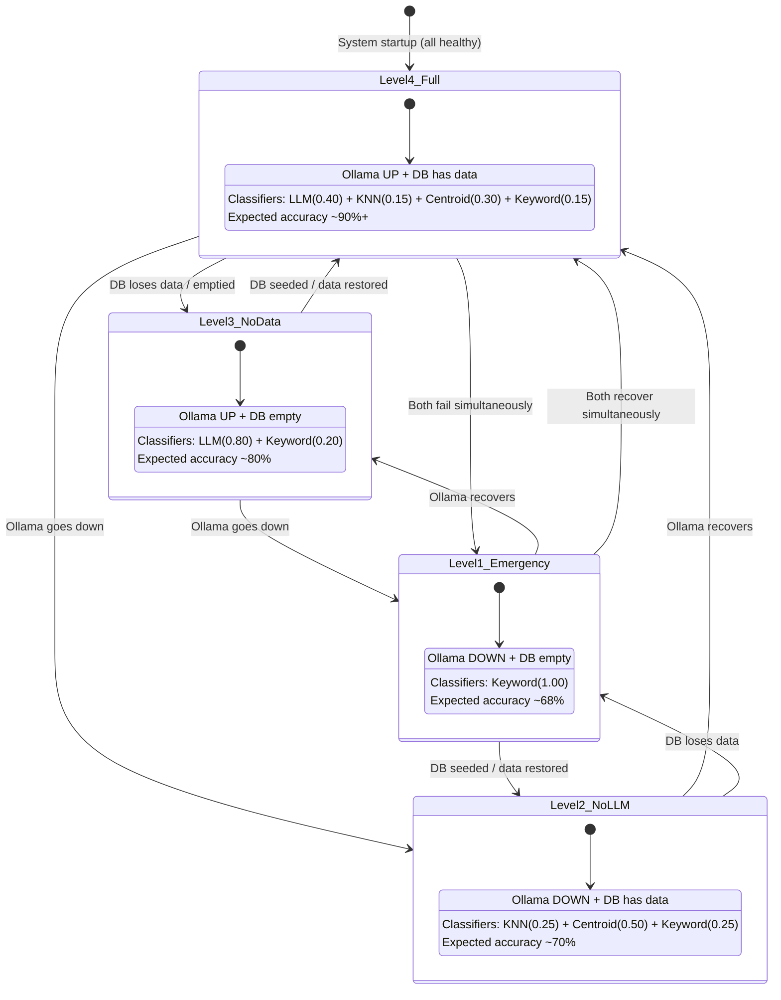

# DeskMind — State Transition Diagrams

> **Nasscom AI-Code-Sarathi Excel Hackathon — Final Round (Jury)**
> **Team**: Arif Asadullah, Aakarsh, Mohit Tomar
> **Date**: June 2026

---

## 1. Ticket Lifecycle State Machine

This diagram models every state a ticket can occupy from the moment it is submitted to the moment it is closed, along with the guards, actors, and conditions that govern each transition.

### 1.1 State Descriptions

| State | Status Value | Description |
|-------|-------------|-------------|
| **Submitted** | `open` | The ticket has just been created through the frontend form or API. The system immediately invokes the 5-stage classification pipeline. This is a transient state -- the ticket moves to Routed or Escalated within seconds, as soon as the AI pipeline returns a result. No human action is required. |
| **Routed** | `routed` | The AI ensemble classified the ticket with confidence >= 0.70 (configurable threshold). The system has automatically assigned the ticket to a target team via the `assigned_to` edge. The ticket appears in that team's queue. The response includes a suggested resolution, recommended expert, and matching runbook. An `audit_log` entry records the classification decision, all 4 classifier votes, confidence signals, and reasoning. |
| **Escalated** | `escalated` | The AI could not classify the ticket with sufficient confidence (< 0.70), OR an engineer has manually re-escalated the ticket because it needs a different team or additional expertise. The ticket is flagged for human review by L1 support staff. The escalation reason is logged in `audit_log`. L1 support can inspect the AI's partial classification, then either manually route the ticket or request more information from the submitter. |
| **In Progress** | `in_progress` | An engineer has picked up the ticket and is actively working on it. The `picked_up_by` field is set to the engineer's email, establishing ownership. If another engineer tries to pick up the same ticket, the API returns a **409 Conflict** (`"Ticket already picked up by {email}"`). Only the engineer who picked up the ticket (or an admin) can resolve it. This transition is triggered via `PATCH /api/tickets/{id}/status` with `status: "in_progress"`. If the engineer is from a different team than the original assignment, the `assigned_to` edge is updated (old edge removed, new edge created). The audit log records who picked up the ticket and when. |
| **Resolved** | `resolved` | The engineer has applied a fix and reported the resolution steps via `POST /api/tickets/{id}/resolve`. This creates a new `resolutions` document with the fix steps and an effectiveness score, a `resolved_with` edge linking the ticket to its resolution, and optionally a `references` edge if a runbook was followed. The ticket's `resolved_at` timestamp is set. If the engineer confirmed the AI's suggested resolution was used, the effectiveness of the source resolution is boosted by +0.05, improving future suggestions. |
| **Closed** | `closed` | The requester has confirmed the fix works and the ticket is permanently closed. This is the terminal state. The full lifecycle -- from submission to closure -- is preserved in the `audit_log` for compliance, analytics, and continuous improvement of the classification models. |

### 1.2 Transition Descriptions

| # | From | To | Trigger | Guard / Condition | Actor | Side Effects |
|---|------|----|---------|-------------------|-------|-------------|
| 1 | `[*]` | Submitted | `POST /api/tickets` | `require_any_authenticated` — any logged-in user | User (any role) | Ticket document created with `_source: "user"`, `submitted_by` = user.email from JWT, embedding computed |
| 2 | Submitted | Routed | Pipeline returns | `confidence >= 0.70` | AI Orchestrator | `assigned_to` edge created, `audit_log` entry with action `classified` |
| 3 | Submitted | Escalated | Pipeline returns | `confidence < 0.70` | AI Orchestrator | `audit_log` entry with action `escalated`, no `assigned_to` edge |
| 4 | Routed | In Progress | `PATCH .../status` | `require_engineer_or_admin` + `require_team_access` (engineer must be on ticket's team). If `picked_up_by` is already set to another engineer's email, returns 409. | Engineer or Admin | `picked_up_by` set to engineer email; `audit_log` records status change with actor = user.email from JWT |
| 5 | Escalated | In Progress | `PATCH .../status` | `require_engineer_or_admin` + `require_team_access` | L1 Support (admin) | `picked_up_by` set to engineer email; `assigned_to` edge created or updated; `audit_log` records triage decision |
| 6 | Escalated | Routed | `PATCH .../status` | `require_engineer_or_admin` — admin can route to any team | Admin | `assigned_to` edge created, status changes to `routed` |
| 7 | In Progress | Resolved | `POST .../resolve` | `require_engineer_or_admin` + `require_team_access`. Only the engineer who picked up the ticket (or admin) can resolve -- 403 otherwise. | Engineer or Admin | `resolutions` doc created, `resolved_with` edge, optional `references` edge, `resolved_at` timestamp set |
| 8 | In Progress | Escalated | `PATCH .../status` | `require_engineer_or_admin` + `require_team_access` | Engineer or Admin | `picked_up_by` cleared (set to null); old `assigned_to` edge may be removed; `audit_log` records re-escalation |
| 9 | Resolved | Closed | Confirmation | Requester verifies the fix works | Requester | Terminal state reached |
| 10 | Resolved | In Progress | Reopen | Fix did not work, issue recurs | Requester | `resolved_at` cleared, resolution effectiveness reduced |

---

## 2. System Degradation State Machine

DeskMind is designed to never fully crash. When components fail, the system gracefully degrades through 4 levels, redistributing classifier weights and reducing accuracy predictably. Health checks run every 5 seconds (cached in Redis).

### 2.1 Level Descriptions

| Level | Name | Condition | Available Classifiers | Weights | Expected Accuracy | Notes |
|-------|------|-----------|----------------------|---------|-------------------|-------|
| **4** | Full | Ollama UP, DB has data | LLM + KNN + Centroid + Keyword | 0.40, 0.15, 0.30, 0.15 | ~90%+ | Normal operating mode. All 4 classifiers run in parallel via `asyncio.gather`. Graph traversal, vector search, error matching, and full-text search all available. Maximum context for decisions. |
| **3** | No Data | Ollama UP, DB empty or inaccessible | LLM + Keyword | 0.80, 0.20 | ~80% | Occurs on fresh deployment before `seed_db.py` runs, or if ArangoDB loses its data volume. KNN and Centroid classifiers are disabled because there are no past tickets to compare against. The LLM compensates with higher weight. No graph traversal or resolution suggestions. |
| **2** | No LLM | Ollama DOWN, DB has data | KNN + Centroid + Keyword | 0.25, 0.50, 0.25 | ~70% | Occurs if Ollama crashes, runs out of memory, or the host machine is unreachable. The three data-driven classifiers take over. Still has access to similar tickets, centroids, and graph context. No LLM reasoning or chat. |
| **1** | Emergency | Ollama DOWN, DB empty | Keyword | 1.00 | ~68% | Worst case. Only the keyword dictionary classifier is available. It uses 25+ keywords per category to make a best-effort classification. No context, no similarity, no graph, no LLM. The keyword-only classifier measures ~68% standalone (eval_leakfree.json keyword = 0.6765); the system is still operational and still routes tickets -- just with lower accuracy. |

### 2.2 Transition Descriptions

| # | From | To | Trigger | Detection | Recovery |
|---|------|----|---------|-----------|----------|
| 1 | Level 4 | Level 3 | DB loses data or ArangoDB is inaccessible | `db.collection("tickets").count() == 0` returns true | Run `seed_db.py` or restore ArangoDB volume |
| 2 | Level 3 | Level 4 | DB is seeded or data is restored | `db.collection("tickets").count() > 0` returns true | Automatic on next health check (within 5s) |
| 3 | Level 4 | Level 2 | Ollama process crashes or host unreachable | `GET {OLLAMA_BASE_URL}/api/version` returns non-200 or times out (2s) | Restart Ollama: `open /Applications/Ollama.app` (Mac) or `systemctl restart ollama` (Linux) |
| 4 | Level 2 | Level 4 | Ollama recovers | `GET {OLLAMA_BASE_URL}/api/version` returns 200 | Automatic on next health check (within 5s) |
| 5 | Level 3 | Level 1 | Ollama goes down while DB is already empty | Both health checks fail | Restore Ollama first (faster), then seed DB |
| 6 | Level 1 | Level 3 | Ollama recovers while DB is still empty | Ollama health check passes | Automatic on next health check |
| 7 | Level 2 | Level 1 | DB loses data while Ollama is already down | DB data check fails | Restore DB data first (seed_db.py) |
| 8 | Level 1 | Level 2 | DB is restored while Ollama is still down | DB data check passes | Automatic on next health check |
| 9 | Level 4 | Level 1 | Both Ollama and DB fail simultaneously | Both health checks fail | Restore both components |
| 10 | Level 1 | Level 4 | Both Ollama and DB recover simultaneously | Both health checks pass | Automatic on next health check |

### 2.3 Health Check Implementation

The `check_health()` function in `orchestrator.py` runs the following checks, with results cached for 5 seconds via a module-level cache:

1. **Ollama check**: Sends `GET /api/version` to Ollama with a 2-second timeout. If the response status is 200, Ollama is considered healthy.
2. **DB data check**: Calls `db.collection("tickets").count()`. If the count is greater than 0, the database is considered to have data.
3. **Redis check**: Calls `redis_client.ping()`. Redis availability does not affect the degradation level but is reported in system health.

The degradation level is determined by a simple truth table:

| Ollama | DB Has Data | Level |
|--------|------------|-------|
| UP | YES | 4 (Full) |
| UP | NO | 3 (No Data) |
| DOWN | YES | 2 (No LLM) |
| DOWN | NO | 1 (Emergency) |

---

## 3. Classification Pipeline State Machine

This diagram models the internal stages of the classification orchestrator -- the 5-stage pipeline that processes every incoming ticket.

```mermaid
stateDiagram-v2
    [*] --> Received : POST /api/tickets

    Received --> Preparing : classify() invoked

    state Preparing {
        [*] --> HealthCheck
        HealthCheck --> EntityExtraction : Level determined
        EntityExtraction --> ErrorScanning : Entities extracted
        ErrorScanning --> QualityScoring : Errors scanned
        QualityScoring --> EmbeddingComputation : Quality scored
        EmbeddingComputation --> [*] : 384-dim vector ready
    }

    Preparing --> Retrieving : Stage 1 complete

    state Retrieving {
        [*] --> fork_retrieve
        fork_retrieve --> VectorSearch : Parallel
        fork_retrieve --> ErrorCodeMatch : Parallel
        fork_retrieve --> GraphTraversal : Parallel
        fork_retrieve --> FullTextSearch : Parallel
        VectorSearch --> join_retrieve
        ErrorCodeMatch --> join_retrieve
        GraphTraversal --> join_retrieve
        FullTextSearch --> join_retrieve
        join_retrieve --> [*]
    }

    state skip_retrieve <<choice>>
    Preparing --> skip_retrieve
    skip_retrieve --> Classifying : DB empty (Level 1 or 3)
    skip_retrieve --> Retrieving : DB has data (Level 2 or 4)
    Retrieving --> Classifying : Stage 2 complete

    state Classifying {
        [*] --> fork_classify
        fork_classify --> LLM_Classifier : Weight 0.40 (if Ollama UP)
        fork_classify --> KNN_Classifier : Weight 0.15 (if DB has data)
        fork_classify --> Centroid_Classifier : Weight 0.30 (if DB has data)
        fork_classify --> Keyword_Classifier : Weight 0.15 (always)
        LLM_Classifier --> join_classify
        KNN_Classifier --> join_classify
        Centroid_Classifier --> join_classify
        Keyword_Classifier --> join_classify
        join_classify --> [*]
    }

    Classifying --> Aggregating : Stage 3 complete (1-4 votes collected)

    state Aggregating {
        [*] --> VoteTally
        VoteTally --> PhaseSelection : Votes counted, categories sorted
        PhaseSelection --> ScenarioCap : Phase 0-5 winner + scenario cap chosen
        ScenarioCap --> ConfidenceFormula : Scenario cap set
        ConfidenceFormula --> ContextBonuses : base = 0.60*avg + 0.25*share + 0.15*wshare
        ContextBonuses --> DisagreementSafety : +0.03 error, +0.02 graph
        DisagreementSafety --> CapApplication : Cap at 0.55 if no supporter >=60% (>=3 active)
        CapApplication --> [*] : final = min(base+bonus, scenario_cap, quality_cap)
    }

    Aggregating --> Deciding : Stage 4 complete

    state Deciding {
        [*] --> ConfidenceEval
        ConfidenceEval --> RouteDecision : confidence >= 0.70
        ConfidenceEval --> EscalateDecision : confidence < 0.70

        state RouteDecision {
            [*] --> TeamLookup
            TeamLookup --> ResolutionSearch
            ResolutionSearch --> RunbookMatch
            RunbookMatch --> ExpertRecommendation
            ExpertRecommendation --> [*]
        }

        state EscalateDecision {
            [*] --> FlagForHuman
            FlagForHuman --> [*]
        }
    }

    Deciding --> [*] : ClassificationResult returned
```

### 3.1 Stage Descriptions

#### Stage 0: Received

| Attribute | Value |
|-----------|-------|
| **Trigger** | `POST /api/tickets` with valid `title` and `description` |
| **Input** | Raw ticket text from the user |
| **Output** | `classify()` function invoked in the orchestrator |
| **Duration** | Instantaneous (API request parsing) |

The ticket arrives at the API layer. FastAPI validates the request body against the `TicketCreate` Pydantic schema (requires `title`, `description`, and optionally `submitted_by`). The validated data is passed to the orchestrator's `classify()` function.

#### Stage 1: Preparing

| Attribute | Value |
|-----------|-------|
| **Purpose** | Extract structured signals from raw text and prepare the embedding |
| **Input** | Raw title and description |
| **Output** | Entity list, quality score, 384-dim embedding |
| **Duration** | ~200-500ms (dominated by embedding computation) |

This stage runs 4 sequential sub-steps:

| Sub-step | Service | Description |
|----------|---------|-------------|
| **Health Check** | `check_health()` | Checks Ollama, ArangoDB, and Redis. Determines the degradation level (1-4). Results are cached for 5 seconds to avoid repeated network calls. |
| **Entity Extraction** | `entity_extractor.extract()` | Scans the ticket text against cached lists of known server names (15), service names (12), and error code patterns (20). Entity lists are cached from ArangoDB with a 5-minute TTL. Output: `{"servers": [...], "services": [...], "error_codes": [...]}`. |
| **Error Scanning** | `errors_confirm_category()` | For each matched error code, maps it to a service and then to a category. If the error-implied category matches the eventual classification, a +0.03 confidence bonus is awarded in Stage 4. |
| **Quality Scoring** | `score_quality()` | Rates the input as HIGH, MEDIUM, or LOW based on text length and entity presence. This sets a maximum confidence cap: HIGH = 0.99, MEDIUM = 0.85, LOW = 0.69. LOW is intentionally kept below the 0.70 auto-route threshold so low-quality/vague tickets always escalate to human review. (Note: `quality_scorer.py` still carries a stale local 0.75 that should be reconciled to 0.69; only the aggregator's 0.69 cap is applied to final routed confidence.) Prevents the system from being overconfident on vague tickets. |
| **Embedding Computation** | `SentenceTransformer` (MiniLM) | Encodes the description into a 384-dimensional vector using the `all-MiniLM-L6-v2` model. This embedding is used by the vector search (Stage 2), KNN classifier (Stage 3), and centroid classifier (Stage 3). |

#### Stage 2: Retrieving

| Attribute | Value |
|-----------|-------|
| **Purpose** | Gather contextual evidence from 4 independent search methods |
| **Input** | Embedding, entities, description text |
| **Output** | Similar tickets, error-matched tickets, graph context, full-text matches |
| **Duration** | ~100-300ms (4 parallel ArangoDB queries) |
| **Skip condition** | Skipped entirely if DB has no data (Level 1 or 3) |

This stage runs 4 searches in parallel:

| Sub-step | Method | Description |
|----------|--------|-------------|
| **Vector Search** | `APPROX_NEAR_COSINE` on `tickets.embedding` | Finds the 5 most semantically similar past tickets using cosine similarity on 384-dim embeddings. Returns tickets with similarity scores. These become the KNN classifier's input. |
| **Error Code Match** | `triggered_by` edge traversal | For each error code matched in Stage 1, follows `triggered_by` edges to find all past tickets that had the same error. Returns those tickets with their resolutions. |
| **Graph Traversal** | Multi-hop traversal from server/service entities | Starting from mentioned servers/services, follows `hosts` -> `managed_by` -> `depends_on` -> `affects` -> `member_of` edges. Returns: managing team, service dependencies, past tickets on same server, team members with expertise. |
| **Full-Text Search** | ArangoDB fulltext index on `tickets.description` | Keyword-level search for terms in the ticket text. Catches matches that embedding similarity might miss (exact product names, version numbers). |

#### Stage 3: Classifying

| Attribute | Value |
|-----------|-------|
| **Purpose** | 4 independent classifiers each vote on the ticket's category |
| **Input** | Ticket text + all Stage 2 context |
| **Output** | 1-4 votes, each with a category and confidence |
| **Duration** | ~2-5s (dominated by LLM if available) |

All active classifiers run in parallel via `asyncio.gather()` — total Stage 3 time equals the slowest classifier (typically LLM). The number of active classifiers depends on the degradation level.

| Classifier | Weight | Method | Available When | Description |
|-----------|--------|--------|---------------|-------------|
| **LLM** (Qwen 2.5:7B) | 0.40 | Prompt-based reasoning | Ollama UP (Level 3, 4) | Sends the ticket text + all retrieved context to Qwen 2.5:7B via Ollama's OpenAI-compatible API. The prompt includes category definitions and instructs the model to identify the root cause. Returns a category and confidence. Slowest but most accurate classifier. |
| **KNN** | 0.15 | Weighted voting by 5 nearest neighbors | DB has data (Level 2, 4) | Takes the top 5 similar tickets from vector search. Each neighbor votes for its category, weighted by similarity score. The majority category wins. Fast and data-driven. |
| **Centroid** | 0.30 | Distance to 6 category centroids | DB has data (Level 2, 4) | Compares the ticket's 384-dim embedding to the 6 pre-computed category centroids. The category with the smallest cosine distance wins. Robust even when no single past ticket is very similar. |
| **Keyword** | 0.15 | Dictionary-based word-boundary matching | Always | Uses `re.search(r'\b...\b')` to match 25+ keywords per category (prevents "access" matching "accessibility"). The category with the highest keyword match count wins. Fastest classifier (sub-millisecond). Always available as the last line of defense. |

#### Stage 4: Aggregating

| Attribute | Value |
|-----------|-------|
| **Purpose** | Combine all classifier votes into a single decision via majority-aware voting with a scenario-capped confidence |
| **Input** | 1-4 classifier votes, quality score, error codes, graph confirmation |
| **Output** | Final category, priority, confidence, scenario (agreement) label |
| **Duration** | <1ms (arithmetic only) |

This stage runs a **6-phase majority-aware voting** scheme (not a flat weighted sum). It counts votes per category, sorts candidates deterministically by `(vote_count desc, weighted_score desc, category_name asc)`, and walks the phases below until one resolves. The resolving phase selects the winner **and** sets a `SCENARIO_CAP`:

| Phase | Scenario | Winner & Cap |
|-------|----------|--------------|
| **Phase 0** | Single classifier (0 or 1 active) | The lone vote wins; cap `single_classifier` = 0.50 |
| **Phase 1** | Unanimous (all active agree) | Agreed category wins; cap `unanimous_4` = 0.95, `unanimous_3` = 0.88, `unanimous_2` = 0.75 |
| **Phase 2** | Supermajority (3+ agree) + strength check | If majority avg conf >= 0.60: `strong_supermajority` = 0.85, else `weak_supermajority` = 0.65; a confident lone dissenter can force `dissenter_override` = 0.60 |
| **Phase 3** | Pair beats singles (2/1/1) + strength check | If pair avg conf >= 0.60 and pair score is competitive: `pair_wins` = 0.70, else `pair_fallback` = 0.60 |
| **Phase 4** | 2v2 split + boundary override | Known Database/Infrastructure boundary override → `boundary_override` = 0.65; otherwise weighted / avg-conf / centroid tiebreak → `weighted_2v2` = 0.65, `avgconf_2v2` = 0.60, `centroid_tiebreak` = 0.60, `unresolved_2v2` = 0.50 |
| **Phase 5** | Total disagreement | Weighted fallback winner; cap `total_disagreement` = 0.50 |

Once the winner and scenario cap are known, the confidence is computed from the **supporting** voters:

| Sub-step | Description |
|----------|-------------|
| **Confidence Formula** | `base = 0.60 * supporter_avg_conf + 0.25 * vote_share + 0.15 * weight_share`, where supporter_avg_conf is the mean confidence of the voters who backed the winner, vote_share is their fraction of active classifiers, and weight_share is their fraction of total weight. |
| **Context Bonuses** | Error code match adds +0.03 if the error-implied category matches the winning category. Graph context confirmation adds +0.02 if the `managed_by` domain from the graph matches the winning category. |
| **Disagreement Safety** | If no supporting classifier has >= 60% confidence and at least 3 classifiers are active, `base` is capped at 0.55 — forcing escalation to human review. This prevents a deceptively high confidence when all classifiers are uncertain. |
| **Cap Application** | `final = round(min(base + bonus, scenario_cap, quality_cap), 3)`, where quality_cap from Stage 1 is HIGH = 0.99, MEDIUM = 0.85, LOW = 0.69. The scenario cap (above) and quality cap together prevent overconfident classifications. |

#### Stage 5: Deciding

| Attribute | Value |
|-----------|-------|
| **Purpose** | Route or escalate the ticket and enrich it with resolution context |
| **Input** | Final category, confidence, priority |
| **Output** | `ClassificationResult` with team, expert, resolution, runbook |
| **Duration** | ~10-50ms (database lookups) |

The decision splits into two paths:

**Route path** (confidence >= 0.70):

| Sub-step | Description |
|----------|-------------|
| **Team Lookup** | Queries `routing_rules` collection for a matching `{category, priority}` pair where `is_active == true`. Joins to `teams` to get the team name. |
| **Resolution Search** | Searches 3 sources for the best resolution: (1) similar tickets from vector search, (2) error-matched tickets, (3) graph context past tickets on the same server. Picks the resolution with the highest `effectiveness` score. |
| **Runbook Match** | Queries `runbooks` for entries matching the ticket's category, then scores each candidate by meaningful title-word overlap with the ticket text (title + description + resolution, generic stopwords excluded). A runbook is returned **only** when its title genuinely overlaps the ticket text (at least one meaningful word); otherwise `find_runbook` returns `None` and no runbook is shown — a wrong cross-topic runbook is never surfaced. |
| **Expert Recommendation** | If graph traversal returned team members, recommends the first expert from the list (typically the one with the most relevant expertise). |

**Escalate path** (confidence < 0.70):

| Sub-step | Description |
|----------|-------------|
| **Flag for Human** | Sets ticket status to `escalated`. No team assignment edge is created. The AI's partial classification and reasoning are still attached to help L1 support make a faster decision. |

### 3.2 Degradation Impact on Pipeline Stages

Not all stages execute at every degradation level. The following table shows what runs at each level:

| Stage | Level 4 (Full) | Level 3 (No Data) | Level 2 (No LLM) | Level 1 (Emergency) |
|-------|---------------|-------------------|-------------------|---------------------|
| **Preparing: Health Check** | Yes | Yes | Yes | Yes |
| **Preparing: Entity Extraction** | Yes (from DB) | No (no DB data) | Yes (from DB) | No (no DB data) |
| **Preparing: Error Scanning** | Yes | No | Yes | No |
| **Preparing: Quality Scoring** | Yes | Yes | Yes | Yes |
| **Preparing: Embedding** | Yes | Yes | Yes | Yes |
| **Retrieving: Vector Search** | Yes | Skipped | Yes | Skipped |
| **Retrieving: Error Code Match** | Yes | Skipped | Yes | Skipped |
| **Retrieving: Graph Traversal** | Yes | Skipped | Yes | Skipped |
| **Retrieving: Full-Text Search** | Yes | Skipped | Yes | Skipped |
| **Classifying: LLM** | Yes (0.40) | Yes (0.80) | Skipped | Skipped |
| **Classifying: KNN** | Yes (0.15) | Skipped | Yes (0.25) | Skipped |
| **Classifying: Centroid** | Yes (0.30) | Skipped | Yes (0.50) | Skipped |
| **Classifying: Keyword** | Yes (0.15) | Yes (0.20) | Yes (0.25) | Yes (1.00) |
| **Aggregating** | Yes (4 votes) | Yes (2 votes) | Yes (3 votes) | Yes (1 vote) |
| **Deciding: Team Lookup** | Yes | No (no rules) | Yes | No (no rules) |
| **Deciding: Resolution Search** | Yes | No | Yes | No |
| **Deciding: Runbook Match** | Yes | No | Yes | No |
| **Deciding: Expert Recommendation** | Yes | No | Yes | No |
